# Overview

<details>
<summary>Relevant source files</summary>

The following files were used as context for generating this wiki page:

- [index.html](index.html)
- [package-lock.json](package-lock.json)
- [package.json](package.json)
- [src/main.tsx](src/main.tsx)
- [src/store/store.ts](src/store/store.ts)

</details>


The secure-storage-front-end application is a React-based web application designed to provide secure document storage and management with comprehensive user authentication and authorization features. This repository contains the frontend codebase that interacts with a separate backend API service to handle document storage, user management, and security operations.

## Purpose and Scope

This document provides a high-level overview of the secure-storage-front-end application architecture, key components, technologies, and main features. It serves as an entry point for understanding the system structure and how different parts interact with each other.

For detailed information about the authentication system, see [Authentication System](#2). For user management features, see [User Management](#3). For application routing details, see [Application Routing](#4).

Sources: [src/main.tsx:1-62](), [index.html:1-16](), [package.json:1-42]()

## System Architecture

### Architecture Overview Diagram

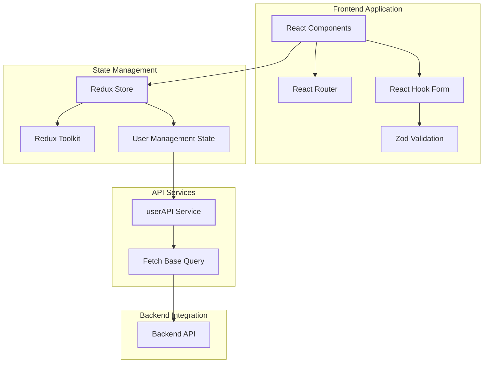

The application follows a modern React architecture with Redux for state management and React Router for navigation. The frontend communicates with the backend through Redux Toolkit Query services, primarily the `userAPI`.

Sources: [src/main.tsx:1-62](), [src/store/store.ts:1-21](), [package.json:12-23]()

## Component Structure

### Application Component Structure Diagram

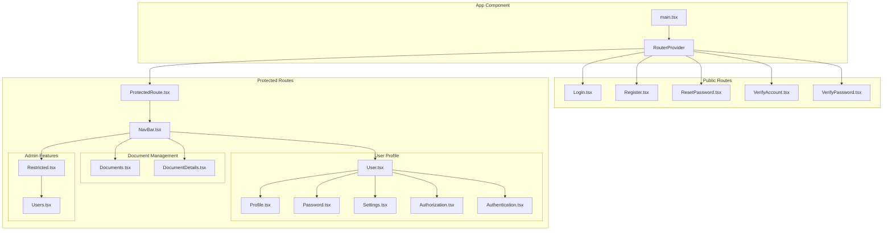

The application is organized into logical component groups: public routes available to all users, protected routes requiring authentication, and restricted routes for administrators. The User component serves as a container for various user profile management tabs.

Sources: [src/main.tsx:1-62]()

## Authentication Flow

### Authentication Flow Diagram

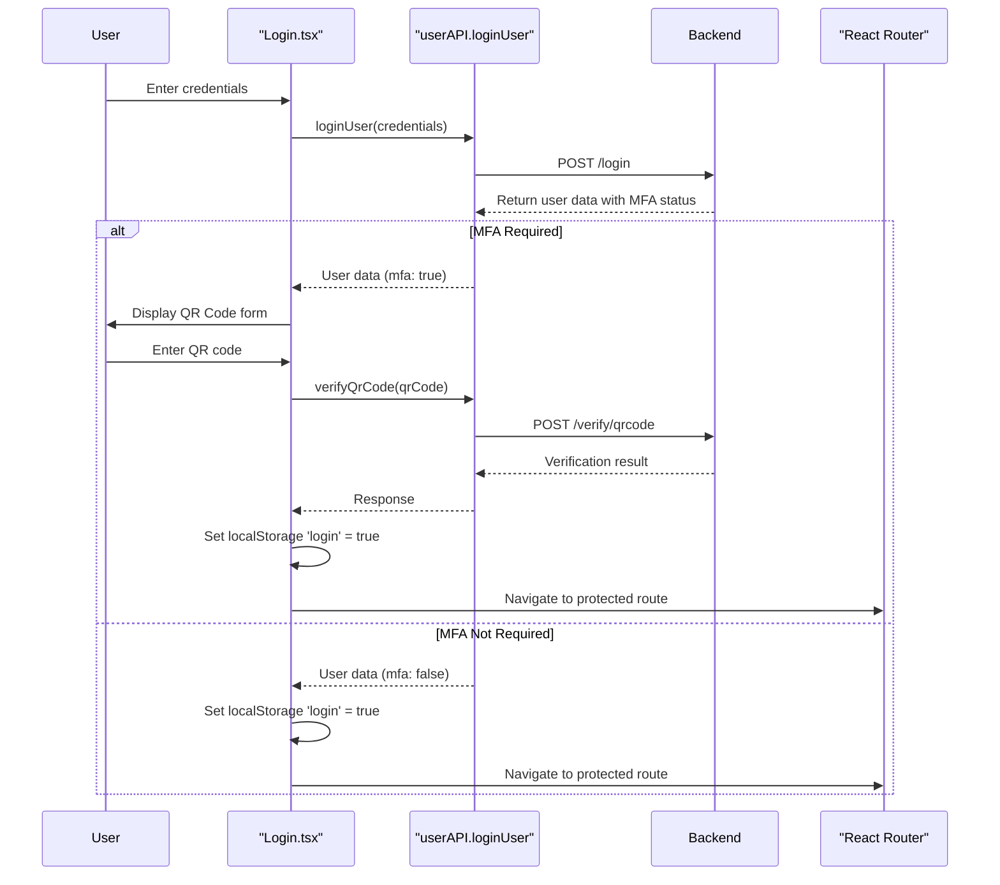

The authentication system supports multi-factor authentication (MFA). When a user logs in, the system checks if MFA is required for their account. If MFA is required, they must complete a QR code verification process before gaining access to protected routes.

Sources: [src/main.tsx:4-15]()

## Technology Stack

| Category | Technologies |
|----------|-------------|
| **Core Framework** | React |
| **State Management** | Redux, Redux Toolkit |
| **Routing** | React Router v7 |
| **Form Handling** | React Hook Form, Zod |
| **API Integration** | Redux Toolkit Query |
| **Styling** | Bootstrap, Bootswatch |
| **Development** | TypeScript, Vite |

The application is built using modern React practices, emphasizing type safety with TypeScript and efficient state management with Redux Toolkit. The form validation system uses React Hook Form with Zod schema validation for robust client-side validation.

Sources: [package.json:12-40](), [index.html:8-9]()

## Key Features

### User Authentication and Security

The application implements a comprehensive security system including:
- Username/password authentication
- Multi-factor authentication with QR codes
- Password reset functionality
- Account verification

Sources: [src/main.tsx:4-14](), [src/main.tsx:29-33]()

### User Management

Users can manage their profiles with features for:
- Profile information updates
- Password changes
- Account settings management
- Authentication settings (MFA)
- Role-based permissions (for administrators)

Sources: [src/main.tsx:42-48]()

### Document Management

The application provides document storage and management capabilities:
- Document browsing and searching
- Document detail views
- Document access control based on user permissions

Sources: [src/main.tsx:36-38]()

### Role-Based Access Control

The application implements role-based access control through a `Restricted` component that conditionally renders content based on user roles:
- Regular users have access to document management and their own profiles
- Administrators have additional access to user management functions

Sources: [src/main.tsx:39-41]()

## Application Data Flow

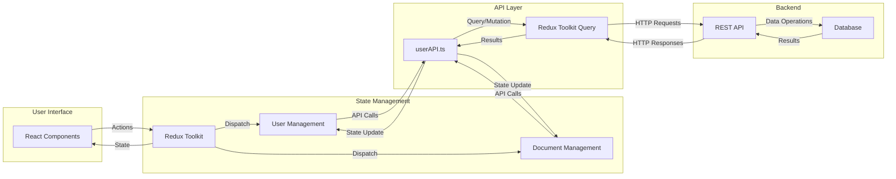

The application follows a unidirectional data flow pattern. User interactions trigger actions that are dispatched to Redux, which manages the application state. API calls are made through the userAPI service using Redux Toolkit Query, which handles caching, loading states, and error handling.

Sources: [src/store/store.ts:1-21]()

## Summary

The secure-storage-front-end application provides a robust platform for secure document storage with comprehensive user management features. It leverages modern web technologies to deliver a responsive and secure user experience, with strong emphasis on authentication, authorization, and document management.

The application architecture follows industry best practices for React applications, with clear separation of concerns between components, state management, and API services. The routing system provides a logical structure for navigation while enforcing security through protected routes.19:T29bc,# Application Architecture

<details>
<summary>Relevant source files</summary>

The following files were used as context for generating this wiki page:

- [package.json](package.json)
- [src/App.tsx](src/App.tsx)
- [src/main.tsx](src/main.tsx)
- [src/services/UserService.ts](src/services/UserService.ts)
- [src/store/store.ts](src/store/store.ts)

</details>


This document provides a technical overview of the secure-storage-front-end application architecture, including its component structure, state management approach, routing system, and core application flows. For detailed information about the specific technologies used, see [Technology Stack](#1.2).

## High-Level Architecture

The secure-storage-front-end application follows a modern React architecture with clear separation of concerns. The application is built as a single-page application (SPA) with the following key architectural components:

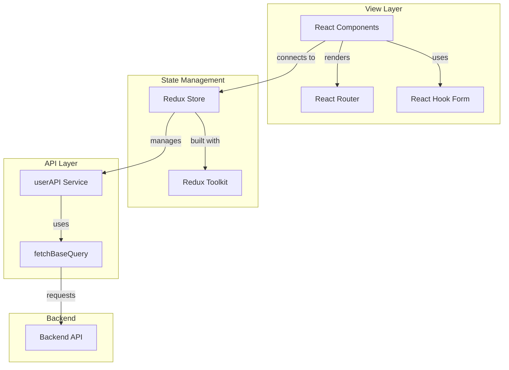

Sources: [src/main.tsx:1-62](), [src/store/store.ts:1-21](), [src/services/UserService.ts:1-200]()

## Application Entry Flow

The application bootstraps through a standard React entry point, where the Redux store is set up and the router is configured:

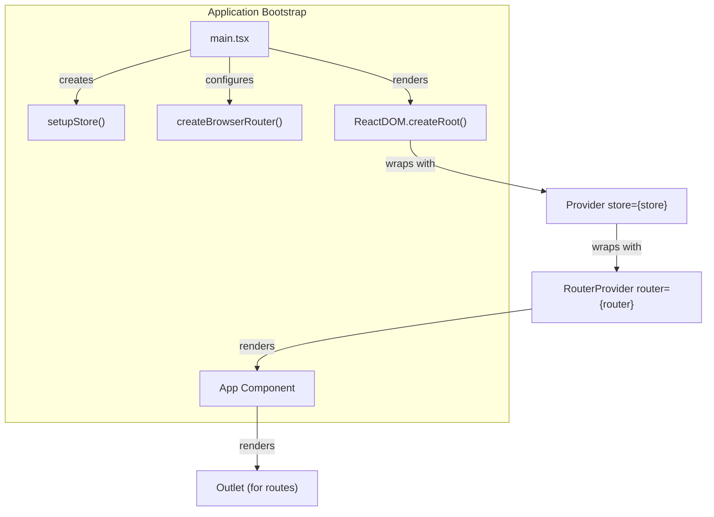

Sources: [src/main.tsx:1-62](), [src/App.tsx:1-13]()

## Routing Architecture

The application uses React Router for navigation, with a hierarchical structure of routes:

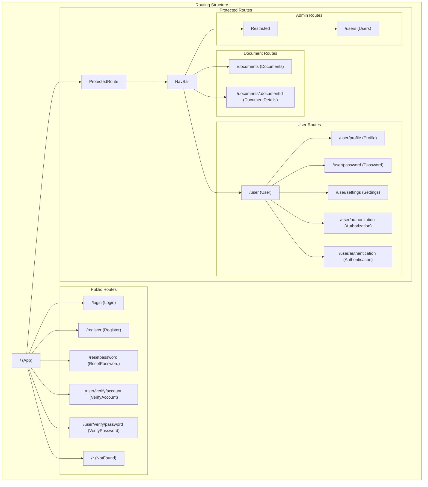

Sources: [src/main.tsx:27-54]()

## Route Protection Mechanism

The application implements a layered security approach through route protection components:

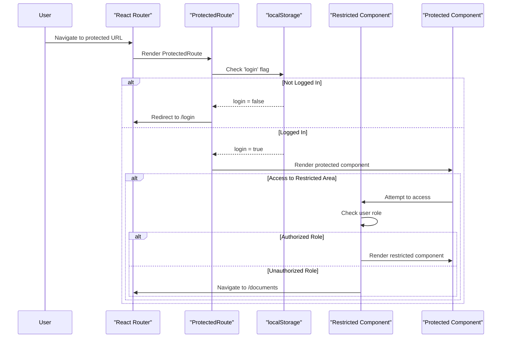

Sources: [src/main.tsx:34-51]()

## State Management Architecture

The application uses Redux Toolkit for state management with a centralized store:

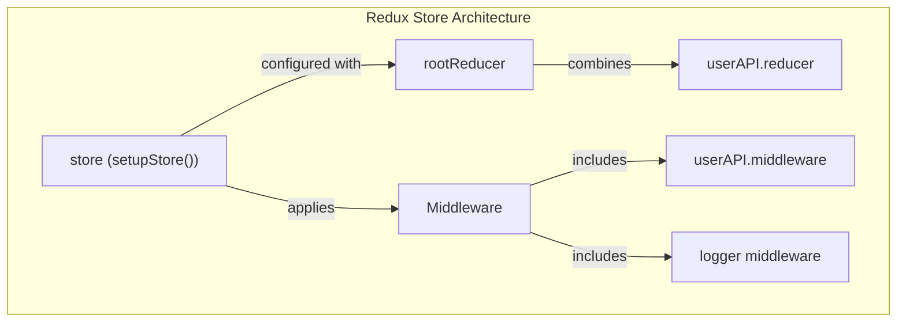

Sources: [src/store/store.ts:1-21]()

## API Service Architecture

The UserService implements a comprehensive API client using Redux Toolkit Query:

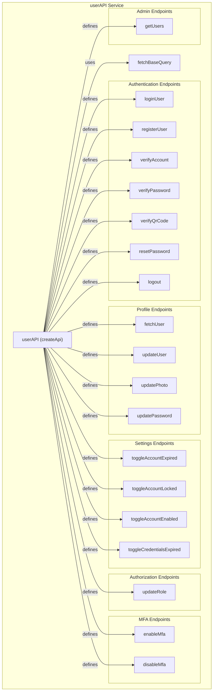

Sources: [src/services/UserService.ts:1-200]()

## Authentication Flow

The application implements a comprehensive authentication system with MFA support:

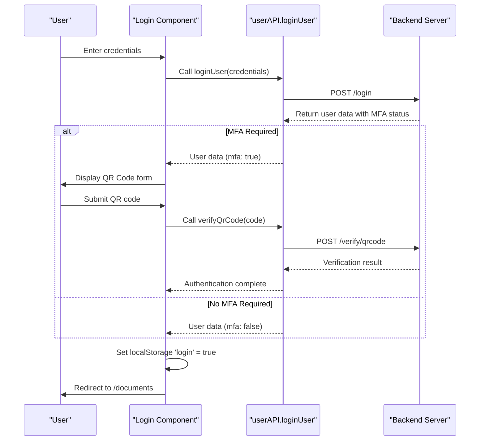

Sources: [src/services/UserService.ts:23-67](), [src/main.tsx:29]()

## Component Structure

The application organizes components into functional areas:

| Area | Components | Purpose |
|------|------------|---------|
| Authentication | Login, Register, ResetPassword, VerifyAccount, VerifyPassword | Handle user authentication flows |
| User Profile | User, Profile, Password, Settings, Authorization, Authentication | Manage user profile information |
| Document Management | Documents, DocumentDetails | View and interact with documents |
| Administration | Users | User management for administrators |
| Navigation | NavBar | Application navigation |
| Security | ProtectedRoute, Restricted | Control access to routes based on authentication and authorization |

Sources: [src/main.tsx:4-24]()

## Technology Integration Model

The application integrates several key technologies:

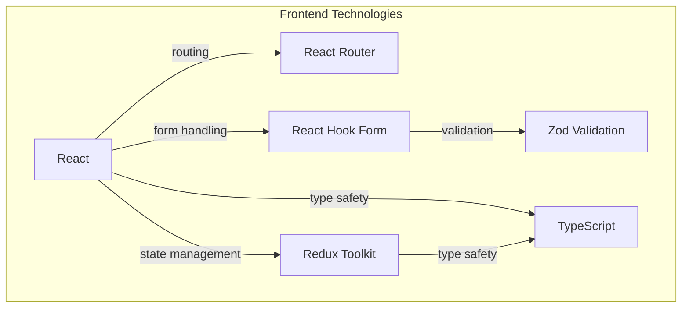

Sources: [package.json:12-23]()1a:T257c,# Technology Stack

<details>
<summary>Relevant source files</summary>

The following files were used as context for generating this wiki page:

- [package-lock.json](package-lock.json)
- [package.json](package.json)
- [src/components/users/Users.tsx](src/components/users/Users.tsx)
- [src/store/store.ts](src/store/store.ts)
- [tsconfig.app.json](tsconfig.app.json)
- [vite.config.ts](vite.config.ts)

</details>


This document provides a detailed overview of the technologies used in the secure-storage-front-end application. It covers the core frameworks, libraries, and tools that form the foundation of the application, explaining how they integrate to create a secure document storage system with robust user authentication and authorization features.

For information about the overall application architecture, see [Application Architecture](#1.1).

## Core Technologies

The secure-storage-front-end application is built using the following core technologies:

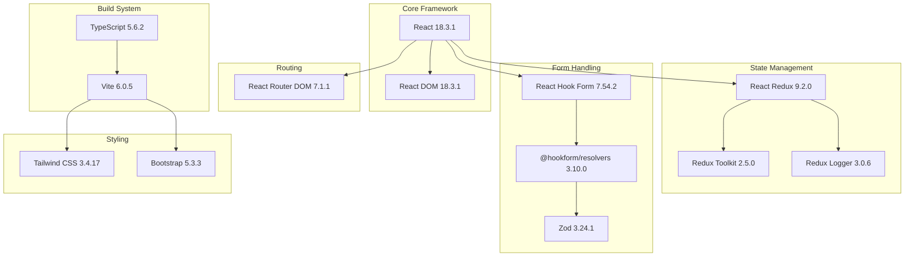

Sources: [package.json:1-42](), [vite.config.ts:1-14]()

## Frontend Framework

The application is built using React 18, a JavaScript library for building user interfaces. React's component-based architecture allows for building reusable UI components that efficiently update when data changes.

### TypeScript Integration

The project uses TypeScript for static type checking, enhancing code quality and developer experience. TypeScript configuration is set to strict mode with additional linting rules for improved code quality.

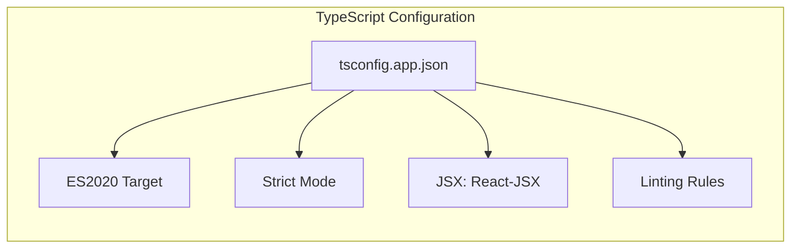

Sources: [tsconfig.app.json:1-28]()

## State Management

The application uses Redux for state management with Redux Toolkit to simplify Redux development. Redux Toolkit provides utilities to reduce boilerplate code and follows best practices.

### Store Configuration

The Redux store is configured using Redux Toolkit's `configureStore` function. The application uses a root reducer that combines all feature reducers and applies middleware for API requests and logging.

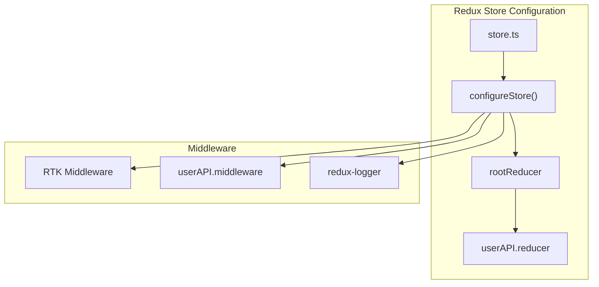

Sources: [src/store/store.ts:1-21]()

## Routing

React Router DOM is used for client-side routing in the application. It enables navigation between different components without refreshing the page, providing a smooth user experience.

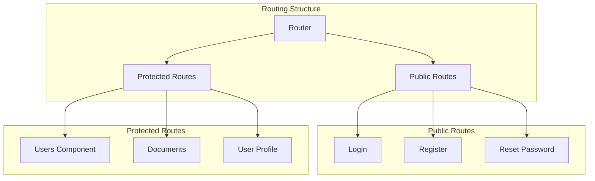

Sources: [src/components/users/Users.tsx:1-9]()

## Form Handling and Validation

The application uses React Hook Form for managing form state and validation. It integrates with Zod, a TypeScript-first schema validation library, through the @hookform/resolvers package.

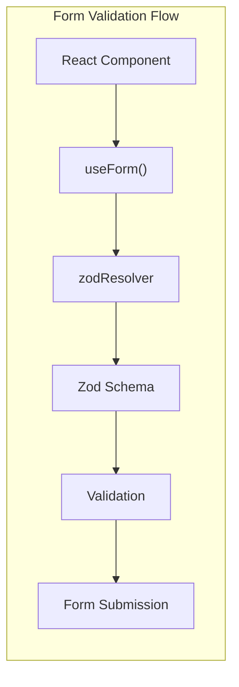

Sources: [package.json:12-23]()

## API Integration

The application interacts with backend services using Redux Toolkit Query (RTK Query). This provides a standardized way to fetch, cache, and update data from the server.

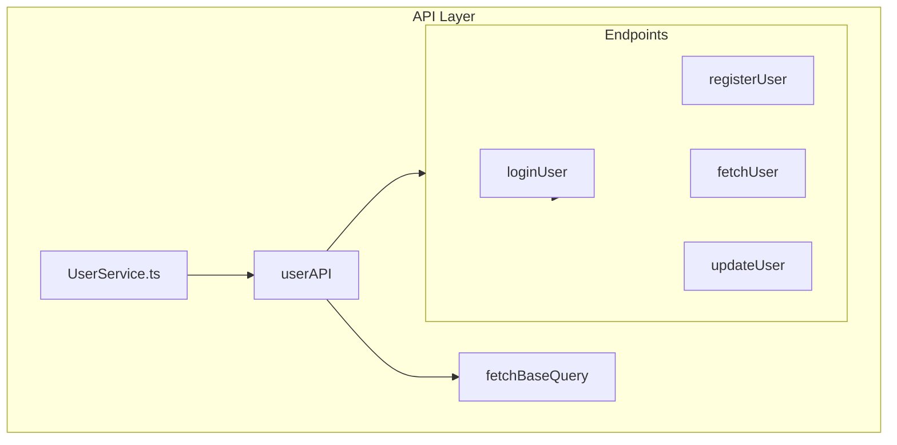

Sources: [src/store/store.ts:1-21]()

## Build and Development Tools

The application uses Vite as the build tool and development server. Vite provides fast development server startup times and optimized production builds.

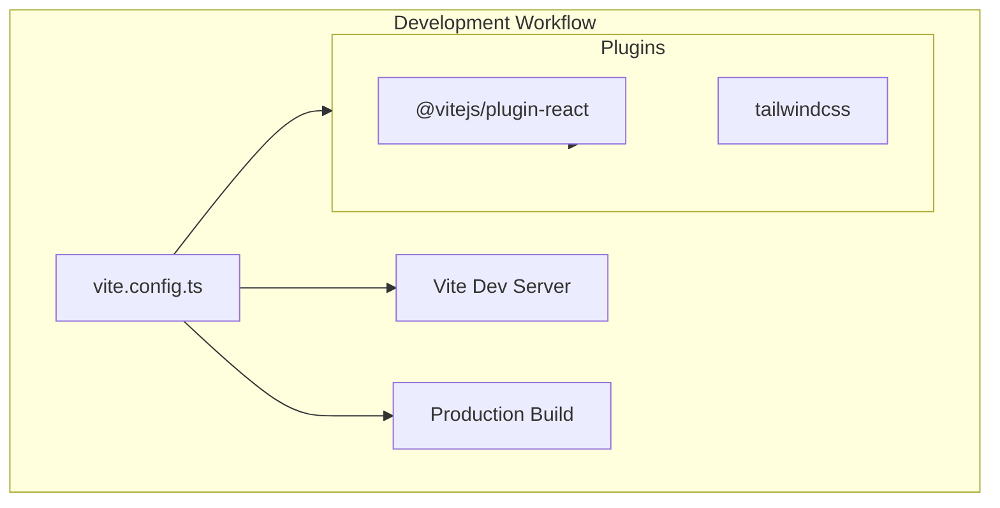

Sources: [vite.config.ts:1-14](), [package.json:6-11]()

## UI and Styling

The application uses a combination of Tailwind CSS and Bootstrap for styling. Tailwind CSS provides utility-first CSS classes while Bootstrap provides pre-built components.

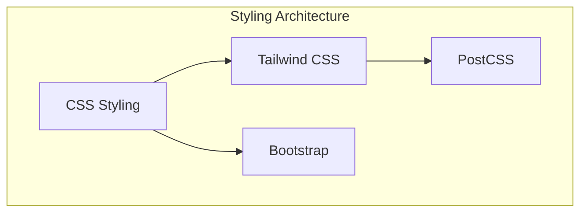

Sources: [vite.config.ts:8-12](), [package.json:32-37]()

## Technology Stack Summary

The following table summarizes the key technologies used in the secure-storage-front-end application:

| Category | Technology | Version | Purpose |
|----------|------------|---------|---------|
| Core Framework | React | 18.3.1 | UI component library |
| | React DOM | 18.3.1 | DOM rendering for React |
| Language | TypeScript | 5.6.2 | Static typing for JavaScript |
| Build System | Vite | 6.0.5 | Build tool and development server |
| State Management | Redux Toolkit | 2.5.0 | State management utilities |
| | React Redux | 9.2.0 | React bindings for Redux |
| | Redux Logger | 3.0.6 | Logging middleware for Redux |
| Routing | React Router DOM | 7.1.1 | Client-side routing |
| Form Handling | React Hook Form | 7.54.2 | Form state management |
| | Zod | 3.24.1 | Schema validation |
| | @hookform/resolvers | 3.10.0 | Integration between React Hook Form and Zod |
| Styling | Tailwind CSS | 3.4.17 | Utility-first CSS framework |
| | Bootstrap | 5.3.3 | CSS component framework |

Sources: [package.json:12-40]()

## Technology Integration Flow

The following diagram illustrates how the different technologies interact within the application:

```mermaid
flowchart TB
    subgraph "User Interface"
        ReactComponents["React Components"]
    end

    subgraph "Form Processing"
        ReactHookForm["React Hook Form"]
        ZodValidation["Zod Validation"]
    end

    subgraph "Routing"
        ReactRouter["React Router"]
    end

    subgraph "State Management"
        ReduxStore["Redux Store"]
        ReduxToolkit["Redux Toolkit"]
    end

    subgraph "API Communication"
        RTKQuery["RTK Query"]
        FetchBaseQuery["fetchBaseQuery"]
    end

    subgraph "Backend"
        API["Backend API"]
    end

    ReactComponents --> ReactHookForm
    ReactHookForm --> ZodValidation
    ReactComponents --> ReactRouter
    ReactComponents --> ReduxStore
    ReduxStore --> ReduxToolkit
    ReduxToolkit --> RTKQuery
    RTKQuery --> FetchBaseQuery
    FetchBaseQuery --> API
```

Sources: [package.json:12-23](), [src/store/store.ts:1-21]()1b:T25a5,# Authentication System

<details>
<summary>Relevant source files</summary>

The following files were used as context for generating this wiki page:

- [src/components/Login.tsx](src/components/Login.tsx)
- [src/models/ICredentials.ts](src/models/ICredentials.ts)
- [src/services/UserService.ts](src/services/UserService.ts)

</details>


This document provides a comprehensive overview of the authentication system implemented in the secure-storage-front-end application. The authentication system manages user login processes, multi-factor authentication (MFA), account verification, password management, and session handling.

For user profile management after authentication, see [User Management](#3). For information about how protected routes are implemented, see [Application Routing](#4).

## Authentication Flow

The authentication system implements two primary authentication paths: standard login and MFA-enabled login.

**Authentication Flow Diagram**
```mermaid
sequenceDiagram
    participant User
    participant Login as "Login Component"
    participant UserAPI as "userAPI Service"
    participant Backend
    
    User->>Login: Enter credentials
    Login->>Login: Validate form (Zod)
    Login->>UserAPI: loginUser(credentials)
    UserAPI->>Backend: POST /login
    Backend-->>UserAPI: Return user data with MFA status
    
    alt MFA Not Required
        UserAPI-->>Login: User data (mfa: false)
        Login->>Login: Set localStorage 'login' = true
        Login->>Login: Navigate to target route
    else MFA Required
        UserAPI-->>Login: User data (mfa: true)
        Login->>User: Display QR Code form
        User->>Login: Enter 6-digit QR code
        Login->>UserAPI: verifyQrCode(qrCodeRequest)
        UserAPI->>Backend: POST /verify/qrcode
        Backend-->>UserAPI: Verification result
        UserAPI-->>Login: Response
        Login->>Login: Set localStorage 'login' = true
        Login->>Login: Navigate to target route
    end
```

Sources: [src/components/Login.tsx:25-62](), [src/services/UserService.ts:23-67]()

## Code Components and Structure

The authentication system consists of several interconnected components that handle different aspects of the authentication process.

**Authentication Components Diagram**
```mermaid
graph TD
    subgraph "Frontend Components"
        Login["Login Component"]
        Register["Register Component"]
        ResetPwd["Reset Password Component"]
        VerifyAccount["Account Verification Component"]
        VerifyPassword["Password Verification Component"]
    end
    
    subgraph "API Integration"
        UserAPI["userAPI Service"]
        LoginMutation["useLoginUserMutation()"]
        VerifyQRMutation["useVerifyQrCodeMutation()"]
        RegisterMutation["useRegisterUserMutation()"]
        ResetPwdMutation["useResetPasswordMutation()"]
        VerifyAccMutation["useVerifyAccountMutation()"]
        VerifyPwdMutation["useVerifyPasswordMutation()"]
    end
    
    subgraph "Form Validation"
        LoginSchema["loginSchema (Zod)"]
        QrCodeSchema["qrCodeSchema (Zod)"]
    end
    
    Login -->|uses| LoginSchema
    Login -->|uses| QrCodeSchema
    Login -->|calls| LoginMutation
    Login -->|calls| VerifyQRMutation
    
    UserAPI -->|defines| LoginMutation
    UserAPI -->|defines| VerifyQRMutation
    UserAPI -->|defines| RegisterMutation
    UserAPI -->|defines| ResetPwdMutation
    UserAPI -->|defines| VerifyAccMutation
    UserAPI -->|defines| VerifyPwdMutation
```

Sources: [src/components/Login.tsx](), [src/services/UserService.ts]()

## Login Implementation

The login process is handled by the `Login` component, which uses React Hook Form with Zod validation and integrates with the `userAPI` service for backend communication.

### Login Form

The login form collects user credentials (email and password) and validates them using Zod schema:

```mermaid
graph TD
    LoginForm["Login Form Component"]
    ZodValidator["loginSchema Validation"]
    ReactHookForm["React Hook Form"]
    LoginMutation["useLoginUserMutation()"]
    
    LoginForm -->|uses| ReactHookForm
    ReactHookForm -->|validates with| ZodValidator
    LoginForm -->|submits via| LoginMutation
    LoginMutation -->|calls| Backend["/login Endpoint"]
```

The component implements form validation using the `loginSchema`:

```
const loginSchema = z.object({
    email: z.string().min(3, 'Email is required').email('Invalid email'),
    password: z.string().min(5, 'Password must be at least 5 characters'),
})
```

Upon successful authentication:
1. If MFA is not enabled, the user is immediately logged in
2. If MFA is enabled, the QR code verification form is displayed

Sources: [src/components/Login.tsx:10-13](), [src/components/Login.tsx:175-219]()

### Multi-Factor Authentication

When MFA is required, the user must complete a second verification step by entering a 6-digit QR code:

```mermaid
graph TD
    QRCodeForm["QR Code Verification Form"]
    ZodValidator["qrCodeSchema Validation"]
    ReactHookForm["React Hook Form"]
    VerifyQRMutation["useVerifyQrCodeMutation()"]
    
    QRCodeForm -->|uses| ReactHookForm
    ReactHookForm -->|validates with| ZodValidator
    QRCodeForm -->|submits via| VerifyQRMutation
    VerifyQRMutation -->|calls| Backend["/verify/qrcode Endpoint"]
```

The QR code validation uses the `qrCodeSchema`:

```
const qrCodeSchema = z.object({
    qrCode1: z.string().min(1).max(1),
    qrCode2: z.string().min(1).max(1),
    qrCode3: z.string().min(1).max(1),
    qrCode4: z.string().min(1).max(1),
    qrCode5: z.string().min(1).max(1),
    qrCode6: z.string().min(1).max(1),
    userId: z.string().min(5)
});
```

The component provides six separate input fields for entering the QR code digits, which are then combined and sent to the backend for verification.

Sources: [src/components/Login.tsx:15-23](), [src/components/Login.tsx:64-148]()

## Authentication API Endpoints

The authentication system interacts with the backend through various API endpoints defined in the `userAPI` service.

**Authentication API Endpoints Table**

| Endpoint Function | HTTP Method | Endpoint Path | Purpose |
|-------------------|-------------|--------------|---------|
| loginUser | POST | /login | Authenticate user with email/password |
| verifyQrCode | POST | /verify/qrcode | Verify MFA QR code |
| registerUser | POST | /register | Register new user account |
| verifyAccount | GET | /verify/account | Verify user account after registration |
| verifyPassword | GET | /verify/password | Verify password reset request |
| resetPassword | POST | /resetpassword | Request password reset email |
| doResetPassword | POST | /resetpassword/reset | Complete password reset process |
| updatePassword | PATCH | /updatepassword | Update user password |
| enableMfa | PATCH | /mfa/setup | Enable multi-factor authentication |
| disableMfa | PATCH | /mfa/cancel | Disable multi-factor authentication |
| logout | POST | /logout | Log out user session |

The API endpoints are implemented using Redux Toolkit Query, which handles caching, loading states, and error handling.

Sources: [src/services/UserService.ts:8-200]()

## Authentication Data Models

The authentication system uses several data models to structure requests and responses:

**Key Authentication Models**

| Interface | File | Purpose |
|-----------|------|---------|
| IUserRequest | ICredentials.ts | Basic login credentials (email, password) |
| IRegisterRequest | ICredentials.ts | Registration data extending IUserRequest |
| QrCodeRequest | IUser.ts | MFA verification code data |
| UpdatePassword | ICredentials.ts | Password change request |
| UpdateNewPassword | ICredentials.ts | Password reset request |

Sources: [src/models/ICredentials.ts:3-17]()

## Session Management

The application uses localStorage to maintain authentication state:

```mermaid
graph TD
    LoginSuccess["Successful Authentication"]
    LocalStorage["localStorage.setItem('login', 'true')"]
    ProtectedRoutes["Protected Routes Component"]
    
    LoginSuccess -->|sets| LocalStorage
    ProtectedRoutes -->|reads| LocalStorage
    LocalStorage -->|controls access to| SecuredContent["Secured Application Content"]
```

After successful authentication (either with or without MFA), the application:
1. Sets `localStorage.setItem('login', 'true')`
2. Redirects to the target route or default route
3. Protected routes check this value to determine if users can access secure content

Sources: [src/components/Login.tsx:50-62]()

## Security Features

The authentication system implements several security features:

1. **Form Validation**: All input is validated using Zod schemas
2. **Multi-Factor Authentication**: Optional QR code verification after password authentication
3. **Secure API Calls**: The application uses Redux Toolkit Query which includes CSRF protection
4. **Error Handling**: Comprehensive error handling for authentication failures

## Authentication System Integration

The authentication system integrates with other parts of the application:

```mermaid
graph TD
    AuthSystem["Authentication System"]
    UserMgmt["User Management System"]
    ProtectedRoutes["Protected Routes"]
    UserAPI["userAPI Service"]
    
    AuthSystem -->|provides identity for| UserMgmt
    AuthSystem -->|enables| ProtectedRoutes
    AuthSystem -->|uses| UserAPI
    UserAPI -->|communicates with| Backend["Backend API"]
```

The authentication system is the foundational security component that enables all other secured functionality within the application.

Sources: [src/components/Login.tsx](), [src/services/UserService.ts]()1c:T29ff,# Login Process

<details>
<summary>Relevant source files</summary>

The following files were used as context for generating this wiki page:

- [src/components/Login.tsx](src/components/Login.tsx)
- [src/models/ICredentials.ts](src/models/ICredentials.ts)
- [src/services/UserService.ts](src/services/UserService.ts)

</details>


This document details the login process implemented in the secure-storage-front-end application. It covers the user interface, form validation, API integration, Multi-Factor Authentication (MFA) handling, and post-login navigation flow. For information about MFA setup and management, see [Multi-Factor Authentication](#2.2).

## 1. Login Flow Overview

The login process follows a two-step verification pattern when MFA is enabled for a user account:

1. User submits their email and password credentials
2. If MFA is enabled for the account, the user is prompted to enter a 6-digit QR code
3. Upon successful verification, the user is redirected to the requested page or the default home page

The diagram below illustrates the complete login flow:

```mermaid
sequenceDiagram
    participant "User" as User
    participant "Login Component" as Login
    participant "userAPI Service" as UserAPI
    participant "Backend API" as Backend
    
    User->>Login: Enter email and password
    Login->>Login: Validate form inputs using Zod
    Login->>UserAPI: Call loginUser mutation
    UserAPI->>Backend: POST /login with credentials
    Backend-->>UserAPI: Return response with user data
    
    alt Login Failed
        UserAPI-->>Login: Return error
        Login-->>User: Display error message
    else Login Successful without MFA
        UserAPI-->>Login: Return success and user data (mfa: false)
        Login->>Login: Set localStorage 'login' = true
        Login->>User: Redirect to target route
    else Login Successful with MFA
        UserAPI-->>Login: Return success and user data (mfa: true)
        Login-->>User: Display QR code verification form
        User->>Login: Enter 6-digit QR code
        Login->>Login: Validate QR code inputs
        Login->>UserAPI: Call verifyQrCode mutation
        UserAPI->>Backend: POST /verify/qrcode with code
        Backend-->>UserAPI: Return verification result
        
        alt QR Verification Failed
            UserAPI-->>Login: Return error
            Login-->>User: Display error message
        else QR Verification Successful
            UserAPI-->>Login: Return success
            Login->>Login: Set localStorage 'login' = true
            Login->>User: Redirect to target route
        end
    end
```

Sources: [src/components/Login.tsx:25-62](). [src/services/UserService.ts:23-67]()

## 2. Login Form Implementation

The login form is implemented in the `Login` component with the following key features:

1. Email and password input fields with validation
2. Form submission handling with loading state indicators
3. Error message display for invalid credentials
4. "Remember me" checkbox option
5. Links to registration and password reset pages

```mermaid
classDiagram
    class "Login Component" {
        +form state
        +validation schema
        +API mutation hooks
        +handleLogin()
        +isFieldValid()
    }
    
    class "loginSchema" {
        +email: string (required, email format)
        +password: string (min 5 chars)
    }
    
    class "useForm Hook" {
        +register()
        +handleSubmit()
        +formState
        +getFieldState()
    }
    
    class "userAPI.useLoginUserMutation" {
        +[loginUser, {data, error, isLoading, isSuccess}]
    }
    
    "Login Component" --> "loginSchema" : uses for validation
    "Login Component" --> "useForm Hook" : manages form
    "Login Component" --> "userAPI.useLoginUserMutation" : calls API
```

The login form uses React Hook Form with Zod schema validation to ensure data validity before submission:

### Form Validation Schema

```
loginSchema = z.object({
    email: z.string().min(3, 'Email is required').email('Invalid email'),
    password: z.string().min(5, 'Password must be at least 5 characters')
})
```

Sources: [src/components/Login.tsx:10-13](). [src/components/Login.tsx:151-223]()

## 3. API Integration

The Login component integrates with the `userAPI` service to handle authentication requests. Two key mutations are used:

1. `useLoginUserMutation` - For the initial login request
2. `useVerifyQrCodeMutation` - For verifying QR codes in MFA

### Login API Flow

1. The `handleLogin` function is triggered on form submission
2. It calls the `loginUser` mutation from the `userAPI` service
3. The API service makes a POST request to `/login` with the user credentials
4. The response includes user data and MFA status

```
const [logginUser, { data, error, isLoading, isSuccess }] = userAPI.useLoginUserMutation();
```

```
const handleLogin = (credentials: IUserRequest) => logginUser(credentials);
```

Sources: [src/components/Login.tsx:30-31](). [src/components/Login.tsx:42](). [src/services/UserService.ts:23-31]()

### API Request/Response Data Types

| API Call | Request Type | Response Type | Endpoint |
|----------|--------------|---------------|----------|
| loginUser | IUserRequest | IResponse\<User\> | POST /login |
| verifyQrCode | QrCodeRequest | IResponse\<User\> | POST /verify/qrcode |

The `IUserRequest` interface defines the structure for login credentials:

```
interface IUserRequest {
    email: string;
    password: string;
}
```

Sources: [src/models/ICredentials.ts:3-6](). [src/services/UserService.ts:23-31](). [src/services/UserService.ts:58-67]()

## 4. Multi-Factor Authentication Handling

When MFA is enabled for a user account, the login process includes a second verification step using a 6-digit QR code.

### QR Code Verification Form

The QR code verification form appears after the initial login succeeds for accounts with MFA enabled. Key features include:

1. Six individual input fields for the 6-digit code
2. Form validation ensuring each field contains exactly one digit
3. Error message display for invalid codes
4. Loading state indicator during verification

```mermaid
flowchart TD
    A["Initial Login Success"] --> B{"User has MFA?"}
    B -->|No| C["Set localStorage 'login' = true"]
    B -->|Yes| D["Display QR Code Form"]
    D --> E["User enters 6-digit code"]
    E --> F["verifyQrCode API call"]
    F --> G{"Verification successful?"}
    G -->|No| H["Display error message"]
    G -->|Yes| C
    C --> I["Navigate to target route"]
    
    style B decision
    style G decision
```

### QR Code Verification Implementation

The QR code verification uses a separate form with its own validation schema:

```
const qrCodeSchema = z.object({
    qrCode1: z.string().min(1, 'QR Code is required').max(1, 'Only one digit per input'),
    qrCode2: z.string().min(1, 'QR Code is required').max(1, 'Only one digit per input'),
    qrCode3: z.string().min(1, 'QR Code is required').max(1, 'Only one digit per input'),
    qrCode4: z.string().min(1, 'QR Code is required').max(1, 'Only one digit per input'),
    qrCode5: z.string().min(1, 'QR Code is required').max(1, 'Only one digit per input'),
    qrCode6: z.string().min(1, 'QR Code is required').max(1, 'Only one digit per input'),
    userId: z.string().min(5, 'User ID is required')
});
```

The verification process combines the individual digits into a single QR code string:

```
const onVerifyQrCode = async (qrCode: QrCodeRequest) => {
    qrCode = { ...qrCode, qrCode: `${qrCode.qrCode1}${qrCode.qrCode2}${qrCode.qrCode3}${qrCode.qrCode4}${qrCode.qrCode5}${qrCode.qrCode6}` };
    await verifyQrCode(qrCode);
}
```

Sources: [src/components/Login.tsx:15-23](). [src/components/Login.tsx:45-48](). [src/components/Login.tsx:64-148]()

## 5. Authentication State Management

The application uses both Redux state management and browser localStorage to track authentication status.

### Local Storage Authentication

After successful login, the component sets a `login` flag in localStorage:

```
if(isSuccess && (!data?.data.user.mfa)){
    localStorage.setItem('login', 'true');
    return location?.state?.from?.pathname ? <Navigate to={location.state.from.pathname} replace /> : <Navigate to={'/'} replace />;
}

if (qrCodeSuccess && data?.data.user.mfa) {
    localStorage.setItem('login', 'true');
    return location?.state?.from?.pathname ? <Navigate to={location?.state?.from?.pathname} replace /> : <Navigate to={'/'} replace />
}
```

The login status is checked at the beginning of the component:

```
const isLoggedIn: boolean = JSON.parse(localStorage.getItem('login')!) as boolean || false;
```

Sources: [src/components/Login.tsx:27](). [src/components/Login.tsx:50-62]()

## 6. Post-Login Navigation

After successful authentication, the user is redirected based on the following logic:

1. If the user was redirected to the login page from a protected route, they are sent back to that route
2. Otherwise, they are redirected to the home page (`/`)

This is implemented using React Router's `Navigate` component and the `useLocation` hook:

```mermaid
flowchart TD
    A["Login Success"] --> B{"location.state.from exists?"}
    B -->|Yes| C["Navigate to location.state.from.pathname"]
    B -->|No| D["Navigate to '/' (home)"]
    
    style B decision
```

The code implementing this logic:

```
if(isLoggedIn){
    return location?.state?.from?.pathname ? <Navigate to={location.state.from.pathname} replace /> : <Navigate to={'/'} replace />;
}

if(isSuccess && (!data?.data.user.mfa)){
    localStorage.setItem('login', 'true');
    return location?.state?.from?.pathname ? <Navigate to={location.state.from.pathname} replace /> : <Navigate to={'/'} replace />;
}

if (qrCodeSuccess && data?.data.user.mfa) {
    localStorage.setItem('login', 'true');
    return location?.state?.from?.pathname ? <Navigate to={location?.state?.from?.pathname} replace /> : <Navigate to={'/'} replace />
}
```

Sources: [src/components/Login.tsx:26-62]()

## 7. Error Handling

The Login component includes comprehensive error handling for both the initial login and QR code verification:

1. Form validation errors are displayed inline
2. API error responses are displayed as alert messages
3. Loading states are indicated with spinner icons

Error handling implementation:

```
{error && <div className="alert alert-dismissible alert-danger">
    {'data' in error ? (error.data as IResponse<void>).message! : 'An error occurred'}
</div>}

{qrCodeError && <div className="alert alert-dismissible alert-danger">
    {'data' in qrCodeError ? (qrCodeError.data as IResponse<void>).message : 'An error occurred'}
</div>}
```

Sources: [src/components/Login.tsx:75-77](). [src/components/Login.tsx:169-171]()1d:T2325,# Multi-Factor Authentication

<details>
<summary>Relevant source files</summary>

The following files were used as context for generating this wiki page:

- [src/components/Login.tsx](src/components/Login.tsx)
- [src/components/profile/Authentication.tsx](src/components/profile/Authentication.tsx)
- [src/enum/http.method.ts](src/enum/http.method.ts)
- [src/models/IResponse.ts](src/models/IResponse.ts)
- [src/models/IUser.ts](src/models/IUser.ts)
- [src/services/UserService.ts](src/services/UserService.ts)

</details>


This document explains the Multi-Factor Authentication (MFA) system implemented in the secure-storage-front-end application. It covers how MFA works during the login process, how users can enable or disable MFA for their accounts, and the technical implementation details of the MFA feature.

For information on the general login process without MFA, see [Login Process](#2.1).

## Overview

The application implements a Time-based One-Time Password (TOTP) multi-factor authentication system using QR codes. When MFA is enabled, users must provide a 6-digit verification code from an authenticator application (like Google Authenticator) after entering their username and password.

```mermaid
flowchart TD
    subgraph "MFA System Components"
        U["User"]
        LA["Login Authentication"]
        MFASetup["MFA Setup/Management"]
        QR["QR Code Generation"]
        TOTP["6-digit TOTP Verification"]
    end

    U -->|"1. Enters credentials"| LA
    LA -->|"2. If MFA enabled"| TOTP
    U -->|"3. Manages MFA"| MFASetup
    MFASetup -->|"4. Enable MFA"| QR
    U -->|"5. Scans with authenticator app"| QR
    U -->|"6. Enters 6-digit code"| TOTP
```

Sources: [src/components/Login.tsx:30-31](), [src/components/profile/Authentication.tsx:6-7]()

## MFA During Login Process

When a user attempts to log in with MFA enabled, they experience a two-step authentication process:

1. The user enters their email and password
2. If credentials are valid and MFA is enabled for the account, the system prompts for a 6-digit verification code
3. The user enters the 6-digit code from their authenticator app
4. The system verifies the code and grants access if valid

```mermaid
sequenceDiagram
    participant User
    participant Login as "Login Component"
    participant UserAPI as "userAPI Service"
    participant Backend

    User->>Login: Enter email/password
    Login->>UserAPI: loginUser(credentials)
    UserAPI->>Backend: POST /login
    Backend-->>UserAPI: Return user data with MFA status
    
    alt MFA Enabled
        UserAPI-->>Login: User data (mfa: true)
        Login->>User: Display QR code verification form
        User->>Login: Enter 6-digit code from authenticator app
        Login->>UserAPI: verifyQrCode(qrCodeRequest)
        UserAPI->>Backend: POST /verify/qrcode
        Backend-->>UserAPI: Verification result
        
        alt Verification Successful
            UserAPI-->>Login: Success response
            Login->>Login: Set localStorage 'login' = true
            Login->>User: Redirect to target route
        else Verification Failed
            UserAPI-->>Login: Error response
            Login->>User: Display error message
        end
    else MFA Not Enabled
        UserAPI-->>Login: User data (mfa: false)
        Login->>Login: Set localStorage 'login' = true
        Login->>User: Redirect to target route
    end
```

Sources: [src/components/Login.tsx:41-47](), [src/components/Login.tsx:54-62](), [src/services/UserService.ts:58-67]()

### QR Code Verification Form

When MFA is enabled, after entering valid credentials, the user is presented with a form to enter the 6-digit verification code. The form splits the code into six individual digit inputs for easier entry.

The verification form:
- Collects six individual digits from separate input fields
- Combines them into a single code for verification
- Includes the user ID for proper verification

The QR code verification request structure:

| Field | Type | Description |
|-------|------|-------------|
| `userId` | string | The unique identifier for the user |
| `qrCode1-6` | string | Individual digits of the verification code |
| `qrCode` | string | Combined verification code (created during submission) |

Sources: [src/components/Login.tsx:64-148](), [src/models/IUser.ts:28-29]()

## Managing MFA Settings

Users can enable or disable MFA for their accounts through the Authentication section in their profile settings.

```mermaid
flowchart TD
    subgraph "MFA Management Flow"
        User["User"]
        AuthComponent["Authentication Component"]
        UserAPI["userAPI Service"]
        Backend["Backend API"]
        
        User -->|"Access profile settings"| AuthComponent
        
        subgraph "Enable MFA"
            AuthComponent -->|"1. Click 'Enable'"| UserAPI
            UserAPI -->|"2. PATCH /mfa/setup"| Backend
            Backend -->|"3. Generate QR code"| UserAPI
            UserAPI -->|"4. Return QR code image"| AuthComponent
            AuthComponent -->|"5. Display QR code"| User
            User -->|"6. Scan with app"| User
        end
        
        subgraph "Disable MFA"
            User -->|"1. Click 'Disable'"| AuthComponent
            AuthComponent -->|"2. Call disableMfa()"| UserAPI
            UserAPI -->|"3. PATCH /mfa/cancel"| Backend
            Backend -->|"4. Disable MFA"| UserAPI
            UserAPI -->|"5. Return updated user"| AuthComponent
            AuthComponent -->|"6. Show MFA disabled"| User
        end
    end
```

Sources: [src/components/profile/Authentication.tsx:4-59](), [src/services/UserService.ts:164-181]()

### Enabling MFA

When a user enables MFA:
1. The system generates a unique QR code
2. The QR code is displayed to the user
3. The user scans the QR code with an authenticator app
4. The user's MFA status is updated to `true`
5. Future logins will require the verification code

The QR code image is stored in the user's profile as `qrCodeImageUri` and is accessible after enabling MFA.

Sources: [src/components/profile/Authentication.tsx:9-11](), [src/services/UserService.ts:164-172](), [src/models/IUser.ts:12]()

### Disabling MFA

When a user disables MFA:
1. The system removes MFA requirement from the user's account
2. The user's MFA status is updated to `false`
3. Future logins will only require username and password

Sources: [src/components/profile/Authentication.tsx:9-11](), [src/services/UserService.ts:173-181]()

## API Integration

The MFA functionality is implemented through several API endpoints managed by the `userAPI` service:

```mermaid
classDiagram
    class "userAPI" {
        +useLoginUserMutation()
        +useVerifyQrCodeMutation()
        +useEnableMfaMutation()
        +useDisableMfaMutation()
    }
    
    class "API Endpoints" {
        POST /login
        POST /verify/qrcode
        PATCH /mfa/setup
        PATCH /mfa/cancel
    }
    
    class "Components" {
        Login
        Authentication
    }
    
    "Components" --> "userAPI" : Uses
    "userAPI" --> "API Endpoints" : Calls
```

### MFA API Endpoints

| API Endpoint | HTTP Method | Purpose | Component |
|--------------|-------------|---------|-----------|
| `/login` | POST | Authenticates user and returns MFA status | Login |
| `/verify/qrcode` | POST | Verifies the 6-digit code during login | Login |
| `/mfa/setup` | PATCH | Enables MFA and returns QR code | Authentication |
| `/mfa/cancel` | PATCH | Disables MFA for the user | Authentication |

Sources: [src/services/UserService.ts:23-31](), [src/services/UserService.ts:58-67](), [src/services/UserService.ts:164-181]()

## Data Model

The MFA feature relies on specific fields in the user data model:

```mermaid
classDiagram
    class "IUser" {
        +userId: string
        +mfa: boolean
        +qrCodeImageUri?: string
        +other user fields...
    }
    
    class "QrCodeRequest" {
        +userId: string
        +qrCode?: string
        +qrCode1: string
        +qrCode2: string
        +qrCode3: string
        +qrCode4: string
        +qrCode5: string
        +qrCode6: string
    }
    
    "QrCodeRequest" --> "IUser" : References userId
```

| Field | Description |
|-------|-------------|
| `mfa` | Boolean flag indicating whether MFA is enabled for the user |
| `qrCodeImageUri` | URL or data URI of the QR code image for MFA setup |
| `QrCodeRequest` | Type used for verifying the 6-digit code during login |

Sources: [src/models/IUser.ts:1-29]()

## Security Considerations

- The MFA implementation adds a second layer of security beyond just username/password
- The 6-digit TOTP codes change every 30 seconds, making them time-limited
- If a user loses access to their authenticator app, they will need administrator assistance to reset MFA
- QR code verification during login is performed server-side for security

Sources: [src/components/profile/Authentication.tsx:21-22](), [src/components/Login.tsx:45-48](), [src/services/UserService.ts:58-67]()1e:T28f5,# Registration and Account Verification

<details>
<summary>Relevant source files</summary>

The following files were used as context for generating this wiki page:

- [src/components/Register.tsx](src/components/Register.tsx)
- [src/components/ResetPassword.tsx](src/components/ResetPassword.tsx)
- [src/components/VerifyAccount.tsx](src/components/VerifyAccount.tsx)
- [src/components/VerifyPassword.tsx](src/components/VerifyPassword.tsx)
- [src/services/UserService.ts](src/services/UserService.ts)

</details>


This document details the user registration process and account verification flow in the secure-storage-front-end application. This section covers how new users can create accounts and how these accounts are subsequently verified before activation. For information about login processes, see [Login Process](#2.1), and for password management, see [Password Management](#2.4).

## 1. Registration System Overview

The registration system allows new users to create accounts in the application by providing their personal information and credentials. After registration, users must verify their accounts through an email verification process before gaining access to the system.

```mermaid
flowchart TB
    subgraph "Registration Process"
        A["User fills registration form"] --> B["Form validation (Zod schema)"]
        B --> C["registerUserMutation API call"]
        C --> D["Backend processes registration"]
        D --> E["Verification email sent to user"]
    end
    
    subgraph "Verification Process"
        F["User clicks verification link"] --> G["VerifyAccount component extracts key"]
        G --> H["verifyAccountMutation API call"]
        H --> I["Backend verifies account"]
        I --> J["Account activated"]
    end
    
    E -.-> F
```

Sources: [src/components/Register.tsx:1-108](), [src/components/VerifyAccount.tsx:1-117](), [src/services/UserService.ts:32-47]()

## 2. Registration Component

The registration form is implemented in the `Register` component, which collects user information including first name, last name, email, and password.

### 2.1 Form Implementation

The registration form uses React Hook Form with Zod validation to ensure data integrity before submission.

```mermaid
classDiagram
    class "Register Component" {
        +useForm() formMethods
        +useRegisterUserMutation() mutation
        +handleRegister() submit
        +render() UI
    }
    
    class "Zod Schema" {
        +email validation
        +firstName validation
        +lastName validation
        +password validation
    }
    
    class "UserAPI Service" {
        +registerUser() endpoint
    }
    
    "Register Component" --> "Zod Schema" : uses for validation
    "Register Component" --> "UserAPI Service" : calls for registration
```

Sources: [src/components/Register.tsx:10-28]()

### 2.2 Registration Form Fields

The registration form collects the following data:

| Field | Validation Rule | Description |
|-------|-----------------|-------------|
| First Name | Required, min length 1 | User's first name |
| Last Name | Required, min length 1 | User's last name |
| Email | Required, valid email format | User's email address (used for verification) |
| Password | Required, min length 5 | User's password |

Sources: [src/components/Register.tsx:10-15]()

### 2.3 Form Validation

The form uses Zod schema validation to ensure all data is valid before submission:

```typescript
const schema = z.object({
    email: z.string().min(3, 'Email is required').email('Invalid email address'),
    firstName: z.string().min(1, 'First name is required'),
    lastName: z.string().min(1, 'Last name is required'),
    password: z.string().min(5, 'Password must be at least 5 characters'),
})
```

The validation is integrated with React Hook Form using the `zodResolver`:

```typescript
const { register, handleSubmit, reset, formState, getFieldState } = useForm<IRegisterRequest>({
  resolver: zodResolver(schema), mode: 'onTouched'
});
```

Sources: [src/components/Register.tsx:10-21]()

## 3. Registration API Integration

The registration form submits data to the backend through the `registerUser` mutation defined in the UserAPI service.

### 3.1 Registration API Endpoint

```mermaid
sequenceDiagram
    participant "Register Component" as RC
    participant "userAPI.registerUser" as API
    participant "Backend /register" as BE
    
    RC->>API: registerUser(registerRequest)
    API->>BE: POST /register
    BE-->>API: Response (success/error)
    API-->>RC: Data with success message or error
    RC->>RC: Display success/error message
    RC->>RC: Reset form if successful
```

Sources: [src/services/UserService.ts:32-40](), [src/components/Register.tsx:23-27]()

### 3.2 Registration Response Handling

The Register component handles both successful and error responses from the API:

- **Success**: Displays a success message and resets the form
- **Error**: Displays the error message returned from the backend

```typescript
{error && <div className="alert alert-dismissible alert-danger">
    {'data' in error ? (error.data as IResponse<void>).message! : 'An error occurred'}
</div>}
{isSuccess && <div className="alert alert-dismissible alert-success">
   {data.message}
</div>}
```

Sources: [src/components/Register.tsx:48-53](), [src/components/Register.tsx:29]()

## 4. Account Verification System

After registration, users must verify their accounts through an email verification process.

### 4.1 Verification Flow

```mermaid
flowchart LR
    A["Email with verification link"] --> B["User clicks link"]
    B --> C["Browser loads /user/verify/account?key=verificationKey"]
    C --> D["VerifyAccount component"]
    D --> E["Extract key from URL"]
    E --> F["Call verifyAccount(key)"]
    F --> G["Backend validates key"]
    G --> H["Account activated"]
    H --> I["Success message shown"]
    I --> J["Link to login"]
```

Sources: [src/components/VerifyAccount.tsx:1-117](), [src/services/UserService.ts:41-47]()

### 4.2 Verification Component

The `VerifyAccount` component handles the account verification process:

1. Extracts the verification key from the URL query parameters
2. Calls the `verifyAccount` mutation with the key
3. Displays appropriate success or error messages
4. Provides navigation options after verification

```typescript
const [verifyAccount, { error: accountError, isSuccess: accountSuccess }] = userAPI.useVerifyAccountMutation();

React.useEffect(() => {
    if (key && location.pathname.includes('/verify/account')) {
        verifyAccount(key);
    }
}, []);
```

Sources: [src/components/VerifyAccount.tsx:8-16]()

### 4.3 Verification States

The VerifyAccount component handles three possible states:

| State | Description | Action |
|-------|-------------|--------|
| No key provided | Invalid verification link | Display error message with links to login or reset password |
| Verification in progress | Key provided but verification not complete | Display loading spinner |
| Verification success | Account successfully verified | Display success message with link to login |

Sources: [src/components/VerifyAccount.tsx:18-113]()

## 5. API Service Implementation

The UserAPI service provides the endpoints for registration and account verification.

### 5.1 Registration API Endpoint

```typescript
registerUser: builder.mutation<IResponse<void>, IRegisterRequest>({
    query: (registerRequest) => ({
        url: '/register',
        method: Http.POST,
        body: registerRequest
    }),
    transformResponse: processResponse<void>,
    transformErrorResponse: processError
})
```

Sources: [src/services/UserService.ts:32-40]()

### 5.2 Account Verification API Endpoint

```typescript
verifyAccount: builder.mutation<IResponse<void>, string>({
    query: (key) => ({
        url: `/verify/account?key=${key}`,
        method: Http.GET
    }),
    transformResponse: processResponse<void>,
    transformErrorResponse: processError
})
```

Sources: [src/services/UserService.ts:41-47]()

## 6. Integration with Password Reset System

The registration and verification system is closely integrated with the password reset system. Users who forget their passwords can initiate a reset through the `ResetPassword` component, which sends a verification link similar to the account verification process.

```mermaid
flowchart TD
    subgraph "Account Creation & Verification"
        A["Register Component"] --> B["Registration API"]
        B --> C["Email with verification link"]
        C --> D["VerifyAccount Component"]
        D --> E["Account activated"]
    end
    
    subgraph "Password Reset"
        F["ResetPassword Component"] --> G["Reset Password API"]
        G --> H["Email with reset link"]
        H --> I["VerifyPassword Component"]
        I --> J["New password set"]
    end
    
    E --> K["User can log in"]
    J --> K
```

Sources: [src/components/ResetPassword.tsx:1-87](), [src/components/VerifyPassword.tsx:1-184](), [src/services/UserService.ts:41-57](), [src/services/UserService.ts:68-87]()

## 7. Data Models

The registration and verification system utilizes the following data models:

### 7.1 Registration Request Model

The `IRegisterRequest` interface defines the data structure for user registration:

```typescript
// From ICredentials model
export interface IRegisterRequest {
    email: string;
    firstName: string;
    lastName: string;
    password: string;
}
```

Sources: [src/services/UserService.ts:5](), [src/components/Register.tsx:3]()

### 7.2 API Response Model

All API responses follow the `IResponse<T>` interface pattern:

```typescript
// From IResponse model
export interface IResponse<T> {
    message?: string;
    data: {
        user: T;
        // Other fields may be present depending on the response type
    };
    status: string;
    // Additional fields for error handling
}
```

Sources: [src/services/UserService.ts:3](), [src/components/Register.tsx:8](), [src/components/VerifyAccount.tsx:4]()

## Summary

The registration and account verification system provides a secure way for new users to create accounts and verify their identities before accessing the application. The system uses React components with form validation, API integration, and a verification process to ensure data integrity and security. After successful registration and verification, users can log in to the application and access its features based on their assigned roles and permissions.1f:T264b,# Password Management

<details>
<summary>Relevant source files</summary>

The following files were used as context for generating this wiki page:

- [src/components/Register.tsx](src/components/Register.tsx)
- [src/components/ResetPassword.tsx](src/components/ResetPassword.tsx)
- [src/components/VerifyPassword.tsx](src/components/VerifyPassword.tsx)
- [src/components/profile/Password.tsx](src/components/profile/Password.tsx)
- [src/services/UserService.ts](src/services/UserService.ts)

</details>


## Purpose and Scope

This document details the password management features in the secure-storage-front-end application. It covers password creation, validation, updating, and recovery processes. For information about the login process using passwords, see [Login Process](#2.1). For details about multi-factor authentication that may be used alongside passwords, see [Multi-Factor Authentication](#2.2).

## Password Management Overview

The application implements several password-related features to maintain security while providing user-friendly management options:

1. **Password Creation** - During registration with password requirements
2. **Password Update** - Changing password when already authenticated
3. **Password Reset** - Recovering access through email verification when unable to log in

```mermaid
flowchart TD
    subgraph "Password Management System"
        Creation["Password Creation"]
        Update["Password Update"]
        Reset["Password Reset"]
    end

    Creation --> Registration["User Registration"]
    Update --> AuthenticatedUser["Authenticated User"]
    Reset --> UnauthenticatedUser["Unauthenticated User"]
    
    Registration --> PasswordValidation["Password Validation"]
    AuthenticatedUser --> PasswordValidation
    UnauthenticatedUser --> EmailVerification["Email Verification"] --> PasswordValidation
    
    PasswordValidation --> Database["Backend Storage"]
```

Sources: [src/components/Register.tsx](), [src/components/profile/Password.tsx](), [src/components/ResetPassword.tsx](), [src/components/VerifyPassword.tsx]()

## Password Validation

The application enforces consistent password validation across all password-related operations using Zod schemas. These schemas ensure that passwords meet security requirements before submission to the backend.

### Common Password Requirements

- Minimum 5 characters for all passwords
- Confirmation must match when setting new passwords

```mermaid
flowchart LR
    subgraph "Zod Schema Validation"
        direction TB
        PasswordInput["Password Input"]
        ValidationRules["Validation Rules"]
        ValidationResult["Validation Result"]
    end

    PasswordInput --> MinLength["Min 5 Characters"]
    PasswordInput --> NewPasswords["New Password Fields"] --> MatchCheck["Password Match Check"]
    
    MinLength --> ValidationResult
    MatchCheck --> ValidationResult
    
    ValidationResult -->|"Valid"| Submit["Submit to Backend"]
    ValidationResult -->|"Invalid"| Error["Display Error Message"]
```

Sources: [src/components/Register.tsx:10-15](), [src/components/profile/Password.tsx:9-21](), [src/components/VerifyPassword.tsx:10-22]()

## Password Update for Authenticated Users

Authenticated users can update their passwords through the Password component in their profile section. This process requires verification of the current password before allowing the change.

### Password Update Process Flow

```mermaid
sequenceDiagram
    participant User
    participant PasswordComponent as "Password Component"
    participant UserService as "userAPI Service"
    participant Backend as "Backend API"
    
    User->>PasswordComponent: Enter current password
    User->>PasswordComponent: Enter new password
    User->>PasswordComponent: Confirm new password
    PasswordComponent->>PasswordComponent: Validate inputs (zod)
    PasswordComponent->>UserService: updatePassword(request)
    UserService->>Backend: PATCH /updatepassword
    Backend-->>UserService: Return success/failure
    UserService-->>PasswordComponent: Return response
    PasswordComponent-->>User: Show success/error message
```

Sources: [src/components/profile/Password.tsx](), [src/services/UserService.ts:108-117]()

### Password Update Component

The Password component provides a form interface for users to update their passwords with validation. It requires:

1. Current password - for security verification
2. New password - the desired new password
3. Confirmation of new password - to prevent typos

The form includes client-side validation using Zod to ensure passwords meet requirements and match before submission to the backend.

Sources: [src/components/profile/Password.tsx]()

## Password Reset Flow

The password reset process is designed for users who cannot log in because they've forgotten their password. It involves multiple components and verification steps to ensure security.

### Password Reset Process Flow

```mermaid
sequenceDiagram
    participant User
    participant ResetPassword as "ResetPassword Component"
    participant VerifyPassword as "VerifyPassword Component"
    participant UserService as "userAPI Service"
    participant Backend as "Backend API"
    
    User->>ResetPassword: Enter email address
    ResetPassword->>UserService: resetPassword(email)
    UserService->>Backend: POST /resetpassword
    Backend-->>UserService: Return success
    UserService-->>ResetPassword: Show success message
    Backend->>User: Send email with verification link
    
    User->>VerifyPassword: Click link in email
    VerifyPassword->>UserService: verifyPassword(key)
    UserService->>Backend: GET /verify/password?key=x
    Backend-->>UserService: Return user data
    UserService-->>VerifyPassword: Show password reset form
    
    User->>VerifyPassword: Enter new password
    User->>VerifyPassword: Confirm new password
    VerifyPassword->>UserService: doResetPassword(request)
    UserService->>Backend: POST /resetpassword/reset
    Backend-->>UserService: Return success/failure
    UserService-->>VerifyPassword: Show success/error message
```

Sources: [src/components/ResetPassword.tsx](), [src/components/VerifyPassword.tsx](), [src/services/UserService.ts:68-87]()

### Reset Password Request

The ResetPassword component provides a form for users to initiate a password reset by entering their email address. Upon successful submission, the system sends a password reset link to the provided email.

Key features:
- Email validation with Zod schema
- Clear error and success messages
- Navigation options to login or register

Sources: [src/components/ResetPassword.tsx](), [src/services/UserService.ts:68-77]()

### Password Reset Verification

The VerifyPassword component handles the verification of password reset requests and allows users to set a new password. This component is accessed via a link sent to the user's email that contains a verification key.

The component:
1. Extracts the verification key from the URL
2. Validates the key with the backend
3. If valid, displays a form to enter and confirm a new password
4. Submits the new password to the backend

Sources: [src/components/VerifyPassword.tsx](), [src/services/UserService.ts:49-57](), [src/services/UserService.ts:78-87]()

## API Services for Password Management

The application uses a centralized UserService API module built with Redux Toolkit Query for all password-related operations.

### Password-Related API Endpoints

| Endpoint | HTTP Method | Purpose | API Function | Redux Hook |
|----------|-------------|---------|--------------|------------|
| `/updatepassword` | PATCH | Update password for authenticated user | `updatePassword` | `useUpdatePasswordMutation` |
| `/resetpassword` | POST | Request password reset email | `resetPassword` | `useResetPasswordMutation` |
| `/verify/password` | GET | Verify password reset token | `verifyPassword` | `useVerifyPasswordMutation` |
| `/resetpassword/reset` | POST | Complete password reset with new password | `doResetPassword` | `useDoResetPasswordMutation` |

Sources: [src/services/UserService.ts:49-57](), [src/services/UserService.ts:68-87](), [src/services/UserService.ts:108-117]()

## Password Data Models

The application uses TypeScript interfaces to define the data structures for password-related operations:

```mermaid
classDiagram
    class UpdatePassword {
        password: string
        newPassword: string
        confirmNewPassword: string
    }
    
    class UpdateNewPassword {
        userId: string
        newPassword: string
        confirmNewPassword: string
    }
    
    class EmailAddress {
        email: string
    }
    
    class IUserRequest {
        email: string
        password: string
    }
    
    class IRegisterRequest {
        email: string
        password: string
        firstName: string
        lastName: string
    }
```

Sources: [src/services/UserService.ts:3-5]()

## Security Considerations

The password management system implements several security measures:

1. All password changes for authenticated users require the current password
2. Password resets require email verification through unique, time-limited links
3. All forms use client-side validation to ensure password requirements are met
4. Passwords are never stored in client-side storage
5. Form submissions use secure HTTPS endpoints

## Integration with Authentication System

The password management system is tightly integrated with the broader authentication system of the application:

1. Password creation is part of the user registration process
2. Successful password resets automatically authenticate the user
3. Password updates may trigger backend credential expiration flags

For more details on the complete authentication system, see [Authentication System](#2).20:T298a,# User Management

<details>
<summary>Relevant source files</summary>

The following files were used as context for generating this wiki page:

- [src/components/profile/User.tsx](src/components/profile/User.tsx)
- [src/enum/http.method.ts](src/enum/http.method.ts)
- [src/models/IResponse.ts](src/models/IResponse.ts)
- [src/models/IUser.ts](src/models/IUser.ts)
- [src/services/UserService.ts](src/services/UserService.ts)

</details>


## Purpose and Scope

This document provides a comprehensive overview of the User Management system within the secure-storage-front-end application. It covers the user profile management, account settings, authorization controls, and authentication features available to users and administrators. For information about the authentication flow and login process, see [Authentication System](#2). For details on API implementation, see [API Integration](#5).

## User Management Overview

The User Management system provides a centralized interface for users to manage their profiles, account settings, passwords, roles and permissions, and multi-factor authentication settings.

```mermaid
graph TD
    User["User Component"] --> Profile["Profile Management"]
    User --> Password["Password Management"]
    User --> Settings["Account Settings"]
    User --> Auth["Authorization Management"]
    User --> MFA["MFA Configuration"]
    
    subgraph "Profile Management"
        Profile --> A["View User Info"]
        Profile --> B["Update Personal Details"]
        Profile --> C["Update Profile Photo"]
    end
    
    subgraph "Account Settings"
        Settings --> D["Toggle Account Expired"]
        Settings --> E["Toggle Account Locked"]
        Settings --> F["Toggle Account Enabled"]
        Settings --> G["Toggle Credentials Expired"]
    end
    
    subgraph "Authorization Management"
        Auth --> H["View Current Role"]
        Auth --> I["Update User Role"]
    end
    
    subgraph "MFA Configuration"
        MFA --> J["Enable MFA"]
        MFA --> K["Disable MFA"]
        MFA --> L["View QR Code"]
    end
```

Sources: [src/components/profile/User.tsx:5-124]()

## Component Structure

The User Management interface is structured as a main component with multiple sub-views accessible through tabs:

```mermaid
classDiagram
    class User {
        +uploadPhoto()
        +selectImage()
    }
    
    class Profile {
        +updateUserInfo()
    }
    
    class Password {
        +updatePassword()
    }
    
    class Settings {
        +toggleAccountExpired()
        +toggleAccountLocked()
        +toggleAccountEnabled()
        +toggleCredentialsExpired()
    }
    
    class Authorization {
        +updateRole()
    }
    
    class Authentication {
        +enableMFA()
        +disableMFA()
    }
    
    User --> Profile
    User --> Password
    User --> Settings
    User --> Authorization
    User --> Authentication
```

Sources: [src/components/profile/User.tsx:5-124]()

## User Component Implementation

The `User` component serves as the container for all user management functionality. It provides:

1. Display of user profile photo and basic information
2. Navigation menu to different user management features
3. Profile photo upload functionality

```mermaid
sequenceDiagram
    participant User as "User Component"
    participant UserAPI as "userAPI Service"
    participant Backend as "Backend Server"
    
    User->>UserAPI: useFetchUserQuery()
    UserAPI->>Backend: GET /profile
    Backend-->>UserAPI: Return user data
    UserAPI-->>User: Display user info
    
    alt Update Photo
        User->>User: selectImage()
        User->>UserAPI: updatePhoto(FormData)
        UserAPI->>Backend: PATCH /photo
        Backend-->>UserAPI: Return updated image URL
        UserAPI-->>User: Update display
    end
```

Sources: [src/components/profile/User.tsx:5-124](), [src/services/UserService.ts:88-97]()

The component displays a sidebar with the user's profile photo, name, and role, along with navigation tabs for different settings pages. The main content area uses React Router's `Outlet` component to render the selected sub-view.

```
Tab Structure:
- Profile
- Password
- Settings
- Authorization
- Authentication (MFA)
```

Sources: [src/components/profile/User.tsx:70-107]()

## User Data Model

The application uses a comprehensive user model that includes personal information, account status flags, and role information:

```mermaid
classDiagram
    class IUser {
        +string userId
        +string firstName
        +string lastName
        +string email
        +string phone
        +string bio
        +string imageUrl
        +string qrCodeImageUri
        +Date lastLogin
        +string role
        +string authorities
        +boolean accountNonExpired
        +boolean accountNonLocked
        +boolean credentialsNonExpired
        +boolean enabled
        +boolean mfa
    }
    
    class User {
        +IUser user
    }
    
    class Role {
        +string role
    }
    
    User "1" -- "1" IUser
```

Sources: [src/models/IUser.ts:1-27]()

## API Integration

The User Management system interacts with the backend through the `userAPI` service, which is implemented using Redux Toolkit's `createApi`. This service provides the following endpoints for user management:

| Endpoint | Method | Description |
|----------|--------|-------------|
| `/profile` | GET | Fetch current user data |
| `/photo` | PATCH | Update user profile photo |
| `/update` | PATCH | Update user profile information |
| `/updatepassword` | PATCH | Update user password |
| `/toggleaccountexpired` | PATCH | Toggle account expired status |
| `/toggleaccountlocked` | PATCH | Toggle account locked status |
| `/toggleaccountenabled` | PATCH | Toggle account enabled status |
| `/togglecredentialsexpired` | PATCH | Toggle credentials expired status |
| `/updaterole` | PATCH | Update user role |
| `/mfa/setup` | PATCH | Enable MFA |
| `/mfa/cancel` | PATCH | Disable MFA |

Sources: [src/services/UserService.ts:8-200]()

```mermaid
graph TD
    subgraph "React Components"
        User["User Component"]
        ProfileTab["Profile Tab"]
        PasswordTab["Password Tab"]
        SettingsTab["Settings Tab"]
        AuthzTab["Authorization Tab"]
        MFATab["Authentication Tab"]
    end
    
    subgraph "Redux State Management"
        RTKQuery["Redux Toolkit Query"]
        userAPI["userAPI Service"]
    end
    
    subgraph "Backend API"
        ProfileEndpoint["/profile"]
        UpdateEndpoint["/update"]
        PhotoEndpoint["/photo"]
        PasswordEndpoint["/updatepassword"]
        SettingsEndpoints["Toggle Settings Endpoints"]
        RoleEndpoint["/updaterole"]
        MFAEndpoints["MFA Endpoints"]
    end
    
    User --> ProfileTab
    User --> PasswordTab
    User --> SettingsTab
    User --> AuthzTab
    User --> MFATab
    
    ProfileTab --> userAPI
    PasswordTab --> userAPI
    SettingsTab --> userAPI
    AuthzTab --> userAPI
    MFATab --> userAPI
    
    userAPI --> RTKQuery
    
    userAPI --> ProfileEndpoint
    userAPI --> UpdateEndpoint
    userAPI --> PhotoEndpoint
    userAPI --> PasswordEndpoint
    userAPI --> SettingsEndpoints
    userAPI --> RoleEndpoint
    userAPI --> MFAEndpoints
```

Sources: [src/services/UserService.ts:8-200](), [src/components/profile/User.tsx:5-124]()

## Account Settings Management

The User Management system allows users to control various account status flags:

| Setting | Description | API Endpoint |
|---------|-------------|--------------|
| Account Expired | Controls whether the account has expired | `/toggleaccountexpired` |
| Account Locked | Controls whether the account is locked | `/toggleaccountlocked` |
| Account Enabled | Controls whether the account is enabled | `/toggleaccountenabled` |
| Credentials Expired | Controls whether the user's credentials have expired | `/togglecredentialsexpired` |

Sources: [src/services/UserService.ts:118-153](), [src/models/IUser.ts:18-21]()

Each toggle operation invalidates the user cache, ensuring that the UI is updated with the latest user status.

## Authorization Management

The system implements role-based access control, with roles defined in the user model:

```mermaid
graph TD
    subgraph "User Roles"
        USER["USER"]
        ADMIN["ADMIN"]
        SUPER_ADMIN["SUPER_ADMIN"]
        MANAGER["MANAGER"]
        PROFESSOR["PROFESSOR"]
    end
    
    subgraph "Role Management"
        AuthzComponent["Authorization Component"]
        UpdateRole["updateRole Mutation"]
    end
    
    AuthzComponent --> UpdateRole
    UpdateRole --> USER
    UpdateRole --> ADMIN
    UpdateRole --> SUPER_ADMIN
    UpdateRole --> MANAGER
    UpdateRole --> PROFESSOR
```

Sources: [src/services/UserService.ts:154-163](), [src/models/IUser.ts:16-17](), [src/models/IUser.ts:25]()

The `updateRole` endpoint allows changing a user's role, which affects their access rights throughout the application.

## Multi-Factor Authentication

The User Management system supports Multi-Factor Authentication (MFA):

```mermaid
sequenceDiagram
    participant User as "User"
    participant AuthComponent as "Authentication Tab"
    participant UserAPI as "userAPI Service"
    participant Backend as "Backend Server"
    
    alt Enable MFA
        User->>AuthComponent: Enable MFA
        AuthComponent->>UserAPI: enableMfa()
        UserAPI->>Backend: PATCH /mfa/setup
        Backend-->>UserAPI: Return user with QR code
        UserAPI-->>AuthComponent: Display QR code
    else Disable MFA
        User->>AuthComponent: Disable MFA
        AuthComponent->>UserAPI: disableMfa()
        UserAPI->>Backend: PATCH /mfa/cancel
        Backend-->>UserAPI: Return user with MFA disabled
        UserAPI-->>AuthComponent: Update MFA status
    end
```

Sources: [src/services/UserService.ts:164-181](), [src/models/IUser.ts:22]()

When MFA is enabled, the system generates a QR code that the user can scan with an authenticator app. This QR code is provided in the `qrCodeImageUri` field of the user data.

## Summary

The User Management system provides a comprehensive set of features for managing user profiles, account settings, authorization, and authentication. It is implemented as a React component with multiple sub-views, integrated with a Redux Toolkit Query-based API service for backend communication.

The system is designed for both regular users managing their own profiles and administrators managing user roles and permissions. The clean separation of concerns between components, with a centralized API service, provides a maintainable and extensible architecture.21:T359d,# User Profile

<details>
<summary>Relevant source files</summary>

The following files were used as context for generating this wiki page:

- [src/components/profile/Profile.tsx](src/components/profile/Profile.tsx)
- [src/components/profile/User.tsx](src/components/profile/User.tsx)
- [src/services/UserService.ts](src/services/UserService.ts)

</details>


## Purpose and Scope

This document describes the User Profile component of the secure-storage-front-end application. The User Profile is responsible for displaying and managing user information, including profile details and profile photo. This document covers the component structure, data flow, and API integration for the User Profile functionality.

For information about password management, see [Password Management](#2.4). For account settings, see [User Settings](#3.2). For role-based access control, see [Authorization and Permissions](#3.3).

## Overview

The User Profile system provides a user interface for viewing and editing personal information. It consists of a main container component (`User.tsx`) that handles layout and navigation, and a child component (`Profile.tsx`) that manages the profile information form.

**User Profile Component Architecture**

```mermaid
graph TD
    subgraph "User.tsx"
        UserComponent["User Component"]
        PhotoUpload["Photo Upload"]
        Navigation["Navigation Links"]
        OutletContainer["Outlet Container"]
    end
    
    subgraph "Profile.tsx"
        ProfileComponent["Profile Component"]
        ProfileForm["Profile Form"]
        ValidationSchema["Zod Validation Schema"]
    end
    
    subgraph "UserService.ts"
        fetchUser["fetchUser Query"]
        updatePhoto["updatePhoto Mutation"]
        updateUser["updateUser Mutation"]
    end
    
    UserComponent --> PhotoUpload
    UserComponent --> Navigation
    UserComponent --> OutletContainer
    OutletContainer --> ProfileComponent
    ProfileComponent --> ProfileForm
    ProfileForm --> ValidationSchema
    
    UserComponent --> fetchUser
    PhotoUpload --> updatePhoto
    ProfileForm --> updateUser
```

Sources: [src/components/profile/User.tsx:1-124](), [src/components/profile/Profile.tsx:1-84](), [src/services/UserService.ts:13-22](), [src/services/UserService.ts:88-107]()

## User Component Structure

The User component (`User.tsx`) serves as the container for all user-related functionality. It has the following key elements:

1. Profile photo display and management
2. User information display (name and role)
3. Navigation menu for different user-related sections
4. Container for child routes via React Router's `<Outlet />`

The component is structured with a two-column layout:
- Left column: User photo, name, role badge, and navigation tabs
- Right column: Content based on the selected tab, rendered through the `<Outlet />` component

**User Interface Layout**

```mermaid
graph TD
    subgraph "User Component Layout"
        UserPhoto["User Photo Section"]
        UserInfo["User Information Display"]
        NavMenu["Navigation Menu"]
        ContentArea["Content Area (Outlet)"]
    end
    
    subgraph "Navigation Options"
        ProfileTab["Profile"]
        PasswordTab["Password"]
        SettingsTab["Settings"]
        AuthorizationTab["Authorization"]
        AuthenticationTab["Authentication (MFA)"]
    end
    
    subgraph "Content Routes"
        ProfileRoute["/user/profile"]
        PasswordRoute["/user/password"]
        SettingsRoute["/user/settings"]
        AuthorizationRoute["/user/authorization"]
        AuthenticationRoute["/user/authentication"]
    end
    
    UserPhoto --> UserInfo
    UserInfo --> NavMenu
    NavMenu --> ContentArea
    
    NavMenu --> ProfileTab
    NavMenu --> PasswordTab
    NavMenu --> SettingsTab
    NavMenu --> AuthorizationTab
    NavMenu --> AuthenticationTab
    
    ProfileTab --> ProfileRoute
    PasswordTab --> PasswordRoute
    SettingsTab --> SettingsRoute
    AuthorizationTab --> AuthorizationRoute
    AuthenticationTab --> AuthenticationRoute
    
    ProfileRoute --> ContentArea
    PasswordRoute --> ContentArea
    SettingsRoute --> ContentArea
    AuthorizationRoute --> ContentArea
    AuthenticationRoute --> ContentArea
```

Sources: [src/components/profile/User.tsx:5-124]()

## User Data Retrieval

The User component retrieves user data using the `fetchUser` query from the UserAPI service. The data flow is as follows:

**User Data Retrieval Flow**

```mermaid
sequenceDiagram
    participant UserComponent as "User Component"
    participant UserAPI as "userAPI.fetchUser"
    participant Backend as "Backend API"
    
    UserComponent->>UserAPI: useFetchUserQuery()
    UserAPI->>Backend: GET /profile
    Backend-->>UserAPI: Return user data
    UserAPI-->>UserComponent: Transform and provide user data
    UserComponent->>UserComponent: Render user interface with data
```

Sources: [src/components/profile/User.tsx:7](), [src/services/UserService.ts:13-22]()

The user data object contains the following key information:

| Field | Description |
|-------|-------------|
| userId | Unique identifier for the user |
| firstName | User's first name |
| lastName | User's last name |
| email | User's email address |
| phone | User's phone number |
| bio | User's biography text |
| imageUrl | URL to the user's profile image |
| role | User's role in the system (e.g., USER, ADMIN) |
| mfa | Boolean indicating if MFA is enabled |
| accountNonLocked | Boolean indicating if account is not locked |
| accountNonExpired | Boolean indicating if account is not expired |
| credentialsNonExpired | Boolean indicating if credentials are not expired |
| enabled | Boolean indicating if account is enabled |

Sources: [src/services/UserService.ts:4](), [src/components/profile/User.tsx:51-68]()

## Profile Photo Management

The User component includes functionality for viewing and updating the user's profile photo. The process works as follows:

1. The current profile photo is displayed from the `imageUrl` in user data
2. A hidden file input is used for selecting a new image
3. When a user clicks the "Change Photo" button, the file input is triggered
4. When a file is selected, the `uploadPhoto` function is called
5. The function creates a FormData object containing the user ID and the file
6. The `updatePhoto` mutation from UserAPI service sends the data to the backend
7. Upon successful update, the user data is refreshed, showing the new photo

**Profile Photo Update Sequence**

```mermaid
sequenceDiagram
    participant User as "User"
    participant Component as "User Component"
    participant FileInput as "Hidden File Input"
    participant UserAPI as "userAPI.updatePhoto"
    participant Backend as "Backend API"
    
    User->>Component: Click "Change Photo"
    Component->>FileInput: Trigger file selection
    User->>FileInput: Select image file
    FileInput->>Component: File selected event
    Component->>Component: Create FormData
    Component->>UserAPI: updatePhoto(formData)
    UserAPI->>Backend: PATCH /photo
    Backend-->>UserAPI: Return new image URL
    UserAPI-->>Component: Invalidate 'User' tag
    Component->>UserAPI: Re-fetch user data
    UserAPI->>Backend: GET /profile
    Backend-->>UserAPI: Return updated user data
    UserAPI-->>Component: Updated user data with new imageUrl
    Component->>Component: Render updated photo
```

Sources: [src/components/profile/User.tsx:6-19](), [src/components/profile/User.tsx:55-60](), [src/components/profile/User.tsx:117-119](), [src/services/UserService.ts:88-97]()

## Profile Information Form

The Profile component (`Profile.tsx`) handles displaying and updating the user's profile information through a form. Key features include:

1. Form with fields for first name, last name, email, phone, and bio
2. Field validation using Zod schema
3. Form state management using React Hook Form
4. Visual feedback for validation states
5. Submission handling to update user information

**Profile Form Data Flow**

```mermaid
graph TD
    subgraph "Profile Component"
        Form["Profile Form"]
        ValidationLogic["Zod Validation"]
        FormState["React Hook Form State"]
        SubmitHandler["Submit Handler"]
    end
    
    subgraph "UserAPI Service"
        FetchQuery["useFetchUserQuery"]
        UpdateMutation["useUpdateUserMutation"]
    end
    
    subgraph "Backend"
        ProfileEndpoint["/profile"]
        UpdateEndpoint["/update"]
    end
    
    FetchQuery --> ProfileEndpoint
    ProfileEndpoint --> Form
    Form --> ValidationLogic
    ValidationLogic --> FormState
    FormState --> SubmitHandler
    SubmitHandler --> UpdateMutation
    UpdateMutation --> UpdateEndpoint
    UpdateEndpoint --> FetchQuery
```

Sources: [src/components/profile/Profile.tsx:9-15](), [src/components/profile/Profile.tsx:17-22](), [src/services/UserService.ts:98-107]()

## Role-Based Access Restrictions

The Profile component implements role-based access restrictions to determine who can edit profile information:

1. Users with the 'USER' role cannot edit their profile information (form fields are disabled)
2. Users with higher privileges (ADMIN, etc.) can edit their profile information

This restriction is implemented by checking the user's role and applying the `disabled` attribute to form fields when the role is 'USER'.

**Role-Based Access Control**

| Role | Can View Profile | Can Edit Profile | Can Change Photo |
|------|------------------|------------------|------------------|
| USER | Yes | No | Yes |
| ADMIN | Yes | Yes | Yes |
| SUPER_ADMIN | Yes | Yes | Yes |
| MANAGER | Yes | Yes | Yes |
| PROFESSOR | Yes | Yes | Yes |

Sources: [src/components/profile/Profile.tsx:37](), [src/components/profile/Profile.tsx:45](), [src/components/profile/Profile.tsx:53](), [src/components/profile/Profile.tsx:61](), [src/components/profile/Profile.tsx:67](), [src/components/profile/Profile.tsx:73]()

## API Integration

The User Profile components integrate with the backend API through the UserAPI service, which provides the following endpoints for profile management:

**API Endpoints for User Profile**

| Endpoint | HTTP Method | Purpose | API Function |
|----------|-------------|---------|--------------|
| /profile | GET | Retrieve user profile data | fetchUser |
| /photo | PATCH | Update profile photo | updatePhoto |
| /update | PATCH | Update profile information | updateUser |

The UserAPI service is implemented using Redux Toolkit Query, which provides features like caching, automatic re-fetching, and loading state management.

Sources: [src/services/UserService.ts:13-22](), [src/services/UserService.ts:88-97](), [src/services/UserService.ts:98-107]()

## Component Implementation Details

### User Component

The User component (`User.tsx`) implements:

1. A file input reference for photo uploads:
   ```javascript
   const inputRef = React.useRef<HTMLInputElement>(null);
   ```

2. API hooks for data fetching and mutations:
   ```javascript
   const { data: userData, isSuccess, isLoading } = userAPI.useFetchUserQuery();
   const [updatePhoto, { isLoading: photoLoading }] = userAPI.useUpdatePhotoMutation();
   ```

3. Functions for photo selection and upload:
   ```javascript
   const selectImage = () => inputRef.current.click();
   const uploadPhoto = async (file: File) => {
     if(file) {
       const form = new FormData();
       form.append('userId', userData.data.user.userId);
       form.append('file', file, file.name);
       await updatePhoto(form);
     }
   };
   ```

4. Loading state handling with placeholders
5. Navigation links using React Router's `NavLink` component
6. A hidden file input for photo selection

Sources: [src/components/profile/User.tsx:5-124]()

### Profile Component

The Profile component (`Profile.tsx`) implements:

1. A validation schema using Zod:
   ```javascript
   const schema = z.object({
     email: z.string().min(3, 'Email is required').email('Invalid email address'),
     firstName: z.string().min(1, 'First name is required'),
     lastName: z.string().min(1, 'Last name is required'),
     bio: z.string().min(5, 'Bio is required'),
     phone: z.string().min(5, 'Phone is required')
   });
   ```

2. Form handling with React Hook Form:
   ```javascript
   const { register, handleSubmit, formState: form, getFieldState } = useForm<IRegisterRequest>({ 
     resolver: zodResolver(schema), 
     mode: 'onTouched' 
   });
   ```

3. API hooks for data fetching and mutations:
   ```javascript
   const { data: user, isSuccess, isLoading } = userAPI.useFetchUserQuery();
   const [update, { isLoading: updateLoading }] = userAPI.useUpdateUserMutation();
   ```

4. Form submission handling:
   ```javascript
   const updateUser = async (user: IRegisterRequest) => await update(user);
   ```

5. Field validation status helper:
   ```javascript
   const isFieldValid = (fieldName: keyof IRegisterRequest): boolean => 
     getFieldState(fieldName, form).isTouched && !getFieldState(fieldName, form).invalid;
   ```

6. A responsive form layout with validation feedback
7. Loading state handling
8. Role-based form field disabling

Sources: [src/components/profile/Profile.tsx:1-84]()

## Summary

The User Profile system in the secure-storage-front-end application provides a comprehensive interface for managing user information. It consists of a main container component (User) that handles layout and navigation, and a child component (Profile) that manages the form for editing profile information. The system integrates with the UserAPI service to fetch and update user data, implements validation using Zod, and includes role-based access controls to restrict who can edit profile information.22:T250e,# User Settings

<details>
<summary>Relevant source files</summary>

The following files were used as context for generating this wiki page:

- [src/components/profile/Settings.tsx](src/components/profile/Settings.tsx)
- [src/enum/account.settings.ts](src/enum/account.settings.ts)
- [src/services/UserService.ts](src/services/UserService.ts)

</details>


This document provides detailed information about the User Settings component in the secure-storage-front-end application. The User Settings feature allows users to manage various account status flags that control account accessibility and security status.

For information about managing user profile information such as names and email addresses, see [User Profile](#3.1). For information about user roles and permissions, see [Authorization and Permissions](#3.3).

## Account Status Flags Overview

The application provides several boolean flags that control the status of user accounts:

| Flag | Description | When TRUE | When FALSE |
|------|-------------|-----------|------------|
| Account Expired | Indicates if the user account has expired | Account is considered expired and may have limited access | Account is valid (non-expired) |
| Account Locked | Indicates if the user account is security-locked | Account is locked and cannot be accessed | Account is unlocked and accessible |
| Account Enabled | Indicates if the user account is active | Account is enabled and can be used | Account is disabled and cannot be used |
| Credentials Expired | Indicates if user credentials have expired | Password has expired and needs reset | Credentials are valid |

Sources:
- [src/components/profile/Settings.tsx:36-97]()
- [src/enum/account.settings.ts:1-6]()

## Component Architecture

The following diagram illustrates the architecture of the User Settings component and its interactions with the API layer:

```mermaid
graph TD
    subgraph "UI Component"
        SC["Settings Component"]
        TSF["toggleSettings function"]
        AET["Account Expired Toggle"]
        ALT["Account Locked Toggle"]
        AEnT["Account Enabled Toggle"]
        CET["Credentials Expired Toggle"]
    end
    
    subgraph "API Service"
        TAEM["toggleAccountExpiredMutation"]
        TALM["toggleAccountLockedMutation"]
        TAEM2["toggleAccountEnabledMutation"]
        TCEM["toggleCredentialsExpiredMutation"]
    end
    
    subgraph "Backend Endpoints"
        BE1["/toggleaccountexpired"]
        BE2["/toggleaccountlocked"]
        BE3["/toggleaccountenabled"]
        BE4["/togglecredentialsexpired"]
    end
    
    SC --> TSF
    AET --> TSF
    ALT --> TSF
    AEnT --> TSF
    CET --> TSF
    
    TSF --> TAEM
    TSF --> TALM
    TSF --> TAEM2
    TSF --> TCEM
    
    TAEM --> BE1
    TALM --> BE2
    TAEM2 --> BE3
    TCEM --> BE4
```

Sources:
- [src/components/profile/Settings.tsx:5-27]()
- [src/services/UserService.ts:118-153]()

## Implementation Details

### Settings Component

The Settings component is responsible for rendering the user interface that displays and allows toggling of account status flags. The component:

1. Fetches the current user data using `useFetchUserQuery`
2. Provides toggle switches for each account setting
3. Implements a unified `toggleSettings` function that handles all toggle operations

Source:
- [src/components/profile/Settings.tsx:5-101]()

### Toggle Settings Function

The core function that handles toggle operations is `toggleSettings`:

```mermaid
graph TD
    subgraph "toggleSettings Function"
        TS["toggleSettings(settings: AccountSettings)"]
        E["Case: EXPIRED"]
        L["Case: LOCKED"]
        En["Case: ENABLED"]
        C["Case: CREDENTIALS_EXPIRED"]
    end
    
    subgraph "API Mutations"
        TAE["toggleAccountExpired()"]
        TAL["toggleAccountLocked()"]
        TAEn["toggleAccountEnabled()"]
        TCE["toggleCredentialsExpired()"]
    end
    
    TS --> E
    TS --> L
    TS --> En
    TS --> C
    
    E --> TAE
    L --> TAL
    En --> TAEn
    C --> TCE
```

This function takes an `AccountSettings` enum value and calls the appropriate mutation based on which setting is being toggled.

Sources:
- [src/components/profile/Settings.tsx:12-27]()
- [src/enum/account.settings.ts:1-6]()

### Account Settings Enum

The application defines an enum `AccountSettings` to identify different account settings:

| Enum Value | String Representation |
|------------|----------------------|
| EXPIRED | '[ACCOUNT] EXPIRED' |
| LOCKED | '[ACCOUNT] LOCKED' |
| ENABLED | '[ACCOUNT] ENABLED' |
| CREDENTIALS_EXPIRED | '[ACCOUNT] CREDENTIALS_EXPIRED' |

Source:
- [src/enum/account.settings.ts:1-6]()

## API Integration

The Settings component integrates with the userAPI service to toggle account settings through backend API endpoints.

### Data Flow When Toggling Settings

```mermaid
sequenceDiagram
    participant U as "User"
    participant SC as "Settings Component"
    participant TSF as "toggleSettings Function"
    participant API as "userAPI Service"
    participant BE as "Backend API"
    
    U->>SC: "Clicks toggle switch"
    SC->>TSF: "Calls toggleSettings(setting)"
    alt Account Expired
        TSF->>API: "Calls toggleAccountExpired()"
        API->>BE: "PATCH /toggleaccountexpired"
    else Account Locked
        TSF->>API: "Calls toggleAccountLocked()"
        API->>BE: "PATCH /toggleaccountlocked"
    else Account Enabled
        TSF->>API: "Calls toggleAccountEnabled()"
        API->>BE: "PATCH /toggleaccountenabled"
    else Credentials Expired
        TSF->>API: "Calls toggleCredentialsExpired()"
        API->>BE: "PATCH /togglecredentialsexpired"
    end
    BE->>API: "Returns response"
    API->>SC: "Updates Redux store (invalidates 'User' tag)"
    SC->>U: "Renders updated toggle state"
```

Sources:
- [src/components/profile/Settings.tsx:12-27]()
- [src/services/UserService.ts:118-153]()

### API Endpoints

The userAPI service provides these endpoints for toggling account settings:

| Endpoint | Method | Description | Redux Toolkit Query Function |
|----------|--------|-------------|------------------------------|
| `/toggleaccountexpired` | PATCH | Toggles account expired status | `toggleAccountExpiredMutation` |
| `/toggleaccountlocked` | PATCH | Toggles account locked status | `toggleAccountLockedMutation` |
| `/toggleaccountenabled` | PATCH | Toggles account enabled status | `toggleAccountEnabledMutation` |
| `/togglecredentialsexpired` | PATCH | Toggles credentials expired status | `toggleCredentialsExpiredMutation` |

All these endpoints:
- Use the HTTP PATCH method
- Require no request body
- Return a response processed by `processResponse<void>`
- Handle errors using `processError`
- Invalidate the 'User' tag in the Redux cache when successful

Sources:
- [src/services/UserService.ts:118-153]()

## Role-Based Access Control

The Settings component implements role-based access control to restrict which users can modify account settings:

```mermaid
graph TD
    subgraph "User Roles"
        UR["USER Role"]
        AR["ADMIN Role"]
        SAR["SUPER_ADMIN Role"]
        MR["MANAGER Role"]
        PR["PROFESSOR Role"]
    end
    
    subgraph "Settings Access"
        TS["Toggle Settings"]
    end
    
    AR --> TS
    SAR --> TS
    MR --> TS
    PR --> TS
    UR -. "No Access (Toggle disabled)" .-> TS
```

In the UI, this is implemented by checking the user's role and disabling toggle switches for users with the 'USER' role:

```jsx
<input type="checkbox" 
  onChange={(event) => toggleSettings(event.target.name as AccountSettings)} 
  checked={!user.data.user.accountNonExpired} 
  name={AccountSettings.EXPIRED} 
  disabled={user?.data.user.role === 'USER'}
  className="form-check-input" />
```

Sources:
- [src/components/profile/Settings.tsx:44-51]()
- [src/components/profile/Settings.tsx:56-61]()
- [src/components/profile/Settings.tsx:68-72]()

## UI Layout

The Settings component UI is organized into two main sections:

1. **Account Settings** - Contains toggles for:
   - Account Expired
   - Account Locked
   - Account Enabled

2. **Credentials Settings** - Contains a toggle for:
   - Credentials Expired (this toggle is always disabled in the current implementation)

Each section includes a heading, description, and the toggle switches presented in a list group.

Sources:
- [src/components/profile/Settings.tsx:36-97]()

## Integration with User Management System

The Settings component is one tab within the larger User Management system:

```mermaid
graph TD
    subgraph "User Management System"
        UM["User Management"]
        UP["Profile Tab"]
        PW["Password Tab"]
        US["Settings Tab"]
        UZ["Authorization Tab"]
        UA["Authentication Tab"]
    end
    
    subgraph "Settings Features"
        US --> AE["Account Expired Toggle"]
        US --> AL["Account Locked Toggle"]
        US --> AEN["Account Enabled Toggle"]
        US --> CE["Credentials Expired Toggle"]
    end
    
    UM --> UP
    UM --> PW
    UM --> US
    UM --> UZ
    UM --> UA
```

Sources:
- Based on the overall application architecture provided in the context

## Summary

The User Settings component provides administrators with the ability to control account status flags that determine account accessibility and security status. The implementation follows a clean architecture with clear separation between UI components and API services, using Redux Toolkit for state management and API integration.23:T1f46,# Authorization and Permissions

<details>
<summary>Relevant source files</summary>

The following files were used as context for generating this wiki page:

- [.github/workflows/deploy.yml](.github/workflows/deploy.yml)
- [src/components/Restricted.tsx](src/components/Restricted.tsx)
- [src/components/profile/Authorization.tsx](src/components/profile/Authorization.tsx)
- [src/services/UserService.ts](src/services/UserService.ts)

</details>


## Purpose and Scope

This document details the role-based access control (RBAC) system implemented in the secure storage front-end application. It explains how user roles and permissions are structured, displayed to users, and enforced throughout the application. For information about the authentication system that verifies user identity, see [Authentication System](#2).

## Role-Based Access Control Overview

The application implements a comprehensive role-based access control system that defines what actions users can perform based on their assigned roles. This ensures that users only have access to the functions and data appropriate for their position.

```mermaid
flowchart TD
    subgraph "Authorization Flow"
        A["User Access Request"] --> B["Protected Route Check"]
        B --> C{"User Authenticated?"}
        C -->|"No"| D["Redirect to Login"]
        C -->|"Yes"| E{"Restricted Route?"}
        E -->|"No"| F["Normal Route Access"]
        E -->|"Yes"| G{"Role Check\n(Restricted.tsx)"}
        G -->|"ADMIN or\nSUPER_ADMIN"| H["Grant Access\n(Outlet)"]
        G -->|"Other Roles"| I["Access Denied\n(403 Error)"]
    end
```

Sources: [src/components/Restricted.tsx:1-41]()

## User Roles

The application supports five distinct user roles, each with different levels of access to system features:

| Role | Description | Access Level |
|------|-------------|--------------|
| USER | Standard user | Basic access to personal documents |
| ADMIN | Administrator | Extended access, including user management |
| SUPER_ADMIN | Super Administrator | Complete system access |
| MANAGER | Manager | Department-level oversight |
| PROFESSOR | Professor | Specialized educational access |

Users with higher privilege roles (ADMIN, SUPER_ADMIN) can access restricted routes, while those with lower privileges will see an access denied message.

```mermaid
graph TD
    subgraph "Role Hierarchy"
        USER["USER"]
        ADMIN["ADMIN"]
        SUPER_ADMIN["SUPER_ADMIN"]
        MANAGER["MANAGER"]
        PROFESSOR["PROFESSOR"]
        
        USER -->|"less privileges"| ADMIN
        ADMIN -->|"less privileges"| SUPER_ADMIN
        USER -.->|"different domain"| MANAGER
        USER -.->|"different domain"| PROFESSOR
    end
```

Sources: [src/components/profile/Authorization.tsx:21-27]()

## Permission Structure

Permissions in the system follow a `resource:action` format, where:
- **Resource**: The entity being accessed (e.g., user, document)
- **Action**: The operation being performed on the resource

### Available Actions

The system supports four standard CRUD operations:

| Action | Visual Indicator | Description |
|--------|------------------|------------|
| create | Blue badge | Permission to create new resources |
| read | Green badge | Permission to view resources |
| update | Yellow badge | Permission to modify existing resources |
| delete | Red badge | Permission to remove resources |

Permissions are displayed to users in the Authorization component as a list with color-coded badges indicating the action type.

```mermaid
graph LR
    subgraph "Permission Structure"
        ROLE["Role (e.g., ADMIN)"] --> PERM1["user:read"]
        ROLE --> PERM2["user:create"]
        ROLE --> PERM3["document:update"]
        ROLE --> PERM4["document:delete"]
        
        PERM1 --> RES1["User Resource"]
        PERM2 --> RES1
        PERM3 --> RES2["Document Resource"]
        PERM4 --> RES2
        
        PERM1 --> ACT1["Read Action"]
        PERM2 --> ACT2["Create Action"]
        PERM3 --> ACT3["Update Action"] 
        PERM4 --> ACT4["Delete Action"]
    end
```

Sources: [src/components/profile/Authorization.tsx:30-47]()

## Implementation Details

### Authorization Component

The Authorization component displays the user's current role and provides an interface for changing roles (if the user has sufficient privileges). It also displays a list of the user's permissions.

```mermaid
sequenceDiagram
    participant User
    participant AuthComp as "Authorization Component"
    participant UserAPI as "userAPI.updateRoleMutation"
    participant Backend as "Backend API"
    
    User->>AuthComp: View authorization page
    AuthComp->>UserAPI: useFetchUserQuery()
    UserAPI->>Backend: GET /profile
    Backend-->>UserAPI: User data with role and permissions
    UserAPI-->>AuthComp: Display current role and permissions
    
    User->>AuthComp: Select new role
    AuthComp->>UserAPI: updateRole({role: newRole})
    UserAPI->>Backend: PATCH /updaterole
    Backend-->>UserAPI: Update confirmation
    UserAPI-->>AuthComp: Refresh user data
```

Role changes are made through the dropdown menu, which calls the `onUpdateRole` function with the selected role. This function uses the `updateRole` mutation from the userAPI service to update the user's role on the backend.

The component also renders a list of the user's current permissions, formatted as resource:action pairs with color-coded badges for different action types.

Sources: [src/components/profile/Authorization.tsx:1-59](), [src/services/UserService.ts:154-163]()

### Restricted Routes

The Restricted component acts as a middleware for protected routes that should only be accessible to administrators. It uses the userAPI service to fetch the current user's data and checks if their role is either 'ADMIN' or 'SUPER_ADMIN'. If the user has the required role, they can access the route (rendered via React Router's `Outlet` component). Otherwise, they see an access denied message.

```mermaid
flowchart TD
    subgraph "Restricted Component Logic"
        A["Component Mount"] --> B{"Fetch User Data\nuserAPI.useFetchUserQuery()"}
        B -->|"Loading"| C["Show Loading State"]
        B -->|"Data Loaded"| D{"Check Role\nrole === 'ADMIN' || role === 'SUPER_ADMIN'"}
        D -->|"Yes"| E["Render Route Content\n<Outlet />"]
        D -->|"No"| F["Show Access Denied\n(403 Error)"]
    end
```

Sources: [src/components/Restricted.tsx:1-41]()

### API Integration

The authorization system integrates with the backend through the userAPI service, which provides endpoints for fetching user data (including roles and permissions) and updating user roles.

Key API endpoints used for authorization include:

1. **Fetch User**:
   - Endpoint: GET `/profile`
   - Used to retrieve the current user's role and permissions
   - Implementation: `fetchUser` query in userAPI

2. **Update Role**:
   - Endpoint: PATCH `/updaterole`
   - Used to change a user's role
   - Implementation: `updateRole` mutation in userAPI

The userAPI service is implemented using Redux Toolkit Query, which provides automatic caching and refetching of data, ensuring that authorization information is kept up-to-date.

Sources: [src/services/UserService.ts:13-22](), [src/services/UserService.ts:154-163]()

## Extending the Authorization System

The current authorization system can be extended by:

1. **Adding new roles**: New roles can be added to the role dropdown in the Authorization component.
2. **Creating new permissions**: New permission strings can be defined following the `resource:action` format.
3. **Implementing more granular access controls**: Additional components similar to `Restricted` can be created to handle more specific access requirements.

For system administrators, it's important to note that role management is a privileged action. Regular users cannot change their own roles, as indicated by the disabled dropdown for users with the 'USER' role.

Sources: [src/components/profile/Authorization.tsx:21]()24:T1cec,# Application Routing

<details>
<summary>Relevant source files</summary>

The following files were used as context for generating this wiki page:

- [.github/workflows/deploy.yml](.github/workflows/deploy.yml)
- [src/App.tsx](src/App.tsx)
- [src/components/Restricted.tsx](src/components/Restricted.tsx)
- [src/main.tsx](src/main.tsx)

</details>


This document details the routing system used in the secure-storage-front-end application. It covers the route structure, protected routes implementation, and role-based access control mechanisms. For information about user interface navigation components, see [User Interface Navigation](#4.2).

## Overview

The secure-storage-front-end application uses React Router v6 to manage navigation and routing. The routing system is designed with security in mind, implementing both authentication checks and role-based access control to protect sensitive routes.

## Routing Architecture

The application's routing structure is defined in the main entry point of the application and follows a hierarchical pattern with nested routes.

```mermaid
graph TD
    subgraph "Route Structure"
        Root["Root ('/')"]
        PublicRoutes["Public Routes"]
        ProtectedRoutes["Protected Routes"]
        NotFound["Not Found ('*')"]

        Root --> PublicRoutes
        Root --> ProtectedRoutes
        Root --> NotFound
        
        subgraph "Public Routes"
            Login["/login"]
            Register["/register"]
            ResetPwd["/resetpassword"]
            VerifyAcc["/user/verify/account"]
            VerifyPwd["/user/verify/password"]
        end
        
        subgraph "Protected Routes (with ProtectedRoute)"
            NavRoutes["Routes with NavBar"]
            
            subgraph "Routes with NavBar"
                Documents["/documents (default)"]
                DocDetails["/documents/:documentId"]
                RestrictedRoutes["Restricted (Admin) Routes"]
                UserRoutes["User Profile Routes"]
            end
            
            subgraph "Restricted Routes"
                Users["/users"]
            end
            
            subgraph "User Profile Routes"
                Profile["/user/profile"]
                Password["/user/password"]
                Settings["/user/settings"]
                Authorization["/user/authorization"]
                Authentication["/user/authentication"]
            end
        end
    end
```

Sources: [src/main.tsx:27-54]()

## Route Definitions

The application routes are defined using React Router's `createBrowserRouter` and `createRoutesFromElements` functions. The root component is `App`, which serves as a container for all other routes through the `Outlet` component.

### Public Routes

These routes are accessible without authentication:

| Route | Component | Purpose |
|-------|-----------|---------|
| `/login` | `Login` | User authentication |
| `/register` | `Register` | New user registration |
| `/resetpassword` | `ResetPassword` | Password reset request |
| `/user/verify/account` | `VerifyAccount` | Account verification after registration |
| `/user/verify/password` | `VerifyPassword` | Password reset verification |

Sources: [src/main.tsx:29-33]()

### Protected Routes

Protected routes are wrapped in the `ProtectedRoute` component, which ensures that only authenticated users can access them:

```mermaid
flowchart TD
    A["User Requests Protected Route"] --> B{"Is User Authenticated?"}
    B -->|"Yes"| C["Render Requested Component"]
    B -->|"No"| D["Redirect to Login Page"]
```

All protected routes include the `NavBar` component, which provides consistent navigation throughout the authenticated portion of the application.

| Route | Component | Notes |
|-------|-----------|-------|
| `/documents` | `Documents` | Default route after login |
| `/documents/:documentId` | `DocumentDetails` | Document detail view with dynamic ID parameter |
| `/users` | `Users` | Admin-only route |
| `/user/*` | `User` (with nested routes) | User profile and settings |

Sources: [src/main.tsx:34-51]()

## Role-Based Access Control

The application implements role-based access control through the `Restricted` component, which wraps routes that should only be accessible to users with specific roles.

```mermaid
flowchart TD
    A["User Requests Admin Route"] --> B{"Loading User Data"}
    B -->|"Complete"| C{"Check User Role"}
    B -->|"Loading"| D["Show Loading Indicator"]
    C -->|"ADMIN or SUPER_ADMIN"| E["Render Requested Component"]
    C -->|"Other Role"| F["Show Access Denied (403)"]
```

The `Restricted` component checks if the current user has either the `ADMIN` or `SUPER_ADMIN` role. If not, it displays an access denied message rather than rendering the requested component.

Sources: [src/components/Restricted.tsx:4-39]()

## Nested Routes

The application makes extensive use of nested routes to create a coherent user experience:

### User Profile Routes

The `/user` path contains several nested routes for different aspects of user management:

```mermaid
graph TD
    User["/user Component"] --> DefaultRedirect["Redirect to /user/profile"]
    User --> Profile["/user/profile Component"]
    User --> Password["/user/password Component"]
    User --> Settings["/user/settings Component"]
    User --> Authorization["/user/authorization Component"] 
    User --> Authentication["/user/authentication Component"]
```

Sources: [src/main.tsx:42-49]()

## Route Relationships

The following diagram illustrates the relationship between components involved in the routing system:

```mermaid
graph TD
    RouterProvider["RouterProvider"] --> Router["Router"]
    Router --> App["App Component"]
    App --> Outlet1["Outlet (Root Level)"]
    
    Outlet1 --> PublicComponents["Public Components (Login, Register, etc.)"]
    Outlet1 --> ProtectedRoute["ProtectedRoute Component"]
    Outlet1 --> NotFound["NotFound Component"]
    
    ProtectedRoute --> NavBar["NavBar Component"]
    NavBar --> Outlet2["Outlet (NavBar Level)"]
    
    Outlet2 --> Documents["Documents Component"]
    Outlet2 --> DocumentDetails["DocumentDetails Component"]
    Outlet2 --> Restricted["Restricted Component"]
    Outlet2 --> User["User Component"]
    
    Restricted --> Outlet3["Outlet (Restricted Level)"]
    Outlet3 --> Users["Users Component"]
    
    User --> Outlet4["Outlet (User Level)"]
    Outlet4 --> ProfileComponents["Profile Components"]
```

Sources: [src/main.tsx:27-54](), [src/App.tsx:3-12]()

## Deployment Considerations

The application is deployed to AWS S3, which requires special configuration for Single Page Applications (SPAs) with client-side routing. This ensures that all routes correctly resolve to the application entry point, allowing React Router to handle the routing.

Sources: [.github/workflows/deploy.yml:33-40]()

## Summary

The routing system in the secure-storage-front-end application provides:

1. A clear separation between public and protected routes
2. Authentication checks through the `ProtectedRoute` component
3. Role-based access control through the `Restricted` component
4. Logical grouping of related functionality through nested routes
5. A consistent user interface through the `NavBar` component

This structure ensures that users can only access routes appropriate to their authentication status and role, enhancing the security of the application.25:T1d47,# Protected Routes

<details>
<summary>Relevant source files</summary>

The following files were used as context for generating this wiki page:

- [.github/workflows/deploy.yml](.github/workflows/deploy.yml)
- [src/components/Restricted.tsx](src/components/Restricted.tsx)
- [src/main.tsx](src/main.tsx)

</details>


## Purpose and Scope

This document explains the Protected Routes implementation in the secure-storage-front-end application. It details how the application restricts access to authenticated users for specific routes, the authentication verification flow, and how Protected Routes integrate with the routing system. For additional information on general application routing structure, refer to [Application Routing](#4), and for role-based access restrictions, see [Authorization and Permissions](#3.3).

## Overview

Protected Routes are a fundamental security mechanism that prevents unauthorized users from accessing private areas of the application. In this codebase, protected routes require users to be authenticated before they can access components like the document viewer, user profiles, and administration features.

```mermaid
flowchart TD
    A["User Navigation Attempt"] --> B{"Is User Authenticated?"}
    B -->|Yes| C["Access Granted\nRender Protected Content"]
    B -->|No| D["Redirect to Login Page"]
    C --> E{"Role-based Access\n(if applicable)"}
    E -->|Authorized| F["Render Admin Content"]
    E -->|Unauthorized| G["Show Access Denied"]
```

Sources: [src/main.tsx:34-51](), [src/components/Restricted.tsx:4-39]()

## Implementation Details

The Protected Routes system consists of two main components:

1. **ProtectedRoute Component**: Verifies user authentication status
2. **Restricted Component**: Provides role-based access control within protected routes

### Protected Route Component

The `ProtectedRoute` component serves as a wrapper around routes that require authentication. It checks if the user is logged in and either allows access to the protected content or redirects to the login page.

```mermaid
classDiagram
    class ProtectedRoute {
        +Outlet component
        +Checks authentication
        +Redirects if not authenticated
    }
    class Route {
        +path: string
        +element: ReactElement
    }
    class Outlet {
        +Renders nested routes
    }
    Route -- ProtectedRoute: wraps
    ProtectedRoute -- Outlet: renders
```

Sources: [src/main.tsx:34-51]()

### Route Configuration

In the main router configuration, the `ProtectedRoute` component is used as a wrapper around routes that require authentication:

```mermaid
graph TD
    subgraph "Public Routes"
        Login["/login"]
        Register["/register"]
        ResetPwd["/resetpassword"]
        VerifyAcc["/user/verify/account"]
        VerifyPwd["/user/verify/password"]
    end
    
    subgraph "Protected Routes"
        ProtectedRoute["ProtectedRoute Component"] --> NavBar["NavBar Component"]
        NavBar --> Documents["/documents"]
        NavBar --> DocDetails["/documents/:documentId"]
        NavBar --> UserProfile["/user/*"]
        
        subgraph "Role-Based Protected Routes"
            Restricted["Restricted Component"] --> Users["/users"]
        end
    end
    
    Root["/"] --> Login
    Root --> Register
    Root --> ResetPwd
    Root --> VerifyAcc
    Root --> VerifyPwd
    Root --> ProtectedRoute
    
    NavBar --> Restricted
```

Sources: [src/main.tsx:27-54]()

## Authentication Flow for Protected Routes

When a user attempts to access a protected route, the following flow occurs:

```mermaid
sequenceDiagram
    participant User
    participant Router as "React Router"
    participant ProtectedRoute as "ProtectedRoute Component"
    participant Auth as "Authentication Store"
    participant Protected as "Protected Content"
    participant Login as "Login Page"
    
    User->>Router: Navigate to protected route
    Router->>ProtectedRoute: Route request
    ProtectedRoute->>Auth: Check authentication status
    
    alt User is authenticated
        Auth-->>ProtectedRoute: Authentication confirmed
        ProtectedRoute->>Protected: Render protected content
        Protected-->>User: Display protected page
    else User is not authenticated
        Auth-->>ProtectedRoute: Not authenticated
        ProtectedRoute->>Login: Redirect to login page
        Login-->>User: Display login form
    end
```

Sources: [src/main.tsx:34-51]()

## Role-Based Access Control

Within protected routes, there's an additional layer of security implemented through the `Restricted` component, which provides role-based access control.

```mermaid
flowchart TD
    A["Authenticated User\nAccessing Admin Route"] --> B["Restricted Component"]
    B --> C{"Check User Role"}
    C -->|"ADMIN or SUPER_ADMIN"| D["Allow Access\nRender Admin Content"]
    C -->|"Other Roles"| E["Display Access Denied\n(403 Forbidden)"]
```

Sources: [src/components/Restricted.tsx:4-39]()

### Restricted Component Implementation

The `Restricted` component checks the user's role after authentication and either allows access to admin-only routes or displays a 403 Forbidden message.

```mermaid
classDiagram
    class Restricted {
        +useFetchUserQuery()
        +Check user.role
        +Render Outlet or AccessDenied
    }
    class UserAPI {
        +useFetchUserQuery()
    }
    class Outlet {
        +Render nested routes
    }
    Restricted --> UserAPI: uses
    Restricted --> Outlet: renders if authorized
```

Sources: [src/components/Restricted.tsx:4-39]()

## Routing Structure with Protection Layers

The complete routing structure showing the protection layers is implemented as follows:

| Route Path | Protection Level | Access Requirements |
|------------|------------------|---------------------|
| `/login`, `/register`, `/resetpassword`, etc. | Public | None |
| `/documents`, `/documents/:documentId` | Protected | Authentication |
| `/user/profile`, `/user/password`, etc. | Protected | Authentication |
| `/users` | Restricted | Authentication + Admin Role |

Sources: [src/main.tsx:27-54]()

## Code Integration

The protected routes are integrated into the routing system in `main.tsx`. The `ProtectedRoute` component wraps all routes that require authentication, providing a single point of control for access to private application features.

```mermaid
graph TD
    subgraph "src/main.tsx"
        Router["createBrowserRouter()"]
        AppRoute["Route path='/'"]
        PublicRoutes["Public Routes"]
        ProtectedRouteWrapper["Route element=ProtectedRoute"]
        ProtectedContent["NavBar + Child Routes"]
    end
    
    Router --> AppRoute
    AppRoute --> PublicRoutes
    AppRoute --> ProtectedRouteWrapper
    ProtectedRouteWrapper --> ProtectedContent
```

Sources: [src/main.tsx:27-54]()

## Summary

Protected Routes form a critical security layer in the secure-storage-front-end application by:

1. Preventing unauthorized access to private application features
2. Redirecting unauthenticated users to the login page
3. Working in conjunction with role-based access control for fine-grained permissions
4. Providing a consistent authentication check across multiple routes

The implementation uses React Router's nested routing capabilities to create a clean separation between public and protected areas of the application, with additional role-based restrictions for administrative features.

Sources: [src/main.tsx:34-51](), [src/components/Restricted.tsx:4-39]()26:T2dd8,# User Interface Navigation

<details>
<summary>Relevant source files</summary>

The following files were used as context for generating this wiki page:

- [src/components/NavBar.tsx](src/components/NavBar.tsx)
- [src/components/document/Documents.tsx](src/components/document/Documents.tsx)
- [src/main.tsx](src/main.tsx)

</details>


## Purpose and Scope

This document provides a comprehensive overview of the navigation system implemented in the secure-storage-front-end application. It covers the main navigation components, routing structure, and user interface elements that facilitate movement between different sections of the application. For information about protected routes implementation specifically, see [Protected Routes](#4.1).

## Navigation Structure Overview

The application implements a hierarchical navigation structure with:
- Public routes accessible without authentication (login, register, password reset)
- Protected routes accessible only after authentication
- A consistent navigation bar for authenticated users
- Role-based conditional navigation elements

```mermaid
graph TD
    subgraph "Application Routes"
        Root["/ (Root)"] --> Public["Public Routes"]
        Root --> Protected["Protected Routes"]
        
        subgraph "Public Routes"
            Login["/login"]
            Register["/register"] 
            ResetPwd["/resetpassword"]
            VerifyAcc["/user/verify/account"]
            VerifyPwd["/user/verify/password"]
        end
        
        subgraph "Protected Routes (with NavBar)"
            Documents["/documents (Default)"]
            DocDetails["/documents/:documentId"]
            UserSection["/user/* (Profile Sections)"]
            Users["/users (Role-restricted)"]
        end
        
        Public --> Login
        Public --> Register
        Public --> ResetPwd
        Public --> VerifyAcc
        Public --> VerifyPwd
        
        Protected --> Documents
        Protected --> DocDetails
        Protected --> UserSection
        Protected --> Users
    end
```

Sources: [src/main.tsx:27-54]()

## Main Navigation Component

The primary navigation interface is implemented through the `NavBar` component, which appears only after authentication. This component provides:

1. A fixed top navigation bar with the application logo
2. Primary navigation links to main application sections
3. A user profile dropdown menu with links to user-specific sections
4. Responsive design with mobile navigation toggle

```mermaid
classDiagram
    class NavBar {
        +render()
        -onLogout()
    }
    
    class NavLink {
        +to: string
        +className: string
    }
    
    class Outlet {
        +renders nested route components
    }
    
    class UserAPI {
        +useFetchUserQuery()
    }
    
    NavBar --> UserAPI: fetches user data
    NavBar --> NavLink: uses for navigation
    NavBar --> Outlet: renders nested routes
    
    note for NavBar "Provides main navigation\nand user profile menu"
```

The NavBar includes:
- Main navigation links to "Documents" (always visible)
- "Users" link (conditionally visible based on user role)
- User profile dropdown with the following options:
  - Profile information and image
  - Password management
  - Account settings
  - Authorization settings
  - Authentication (MFA) configuration
  - Logout option

Sources: [src/components/NavBar.tsx:1-86]()

### Navigation Bar Layout

The `NavBar` component renders a Bootstrap-based navigation interface with the following structure:

```
┌─────────────────────────────────────────────────────────────────┐
│ Logo │ Documents │ Users* │                      [User Profile] │
└─────────────────────────────────────────────────────────────────┘
                                                           │
                                                           â–¼
                                ┌──────────────────────────────────────┐
                                │ User Name                            │
                                │ user@email.com                       │
                                │──────────────────────────────────────│
                                │ 🔑 Password                          │
                                │ ⚙️ Settings                          │
                                │ 🛡️ Authorization                     │
                                │ 🔒 Authentication (MFA)              │
                                │──────────────────────────────────────│
                                │ 🚪 Logout                            │
                                └──────────────────────────────────────┘
```

Sources: [src/components/NavBar.tsx:9-82]()

## Routing Implementation

The application uses React Router v6 to define its navigation structure. Routes are created using the `createBrowserRouter` and `createRoutesFromElements` functions.

### Route Structure

```mermaid
graph TD
    subgraph "Route Architecture"
        Root["App (/)"] --> Login["/login"]
        Root --> Register["/register"]
        Root --> ResetPwd["/resetpassword"]
        Root --> VerifyAcc["/user/verify/account"]
        Root --> VerifyPwd["/user/verify/password"]
        Root --> Protected["ProtectedRoute"]
        Root --> NotFound["NotFound (*)"]
        
        Protected --> NavBarRoute["NavBar"]
        
        NavBarRoute --> DocsIndex["/documents (index)"]
        NavBarRoute --> RootRedirect["/ (redirects to /documents)"]
        NavBarRoute --> DocDetails["/documents/:documentId"]
        NavBarRoute --> RestrictedRoute["Restricted"]
        NavBarRoute --> UserRoutes["/user"]
        
        RestrictedRoute --> Users["/users"]
        
        UserRoutes --> UserRedirect["/user (redirects to /user/profile)"]
        UserRoutes --> Profile["/user/profile"]
        UserRoutes --> Password["/user/password"]
        UserRoutes --> Settings["/user/settings"]
        UserRoutes --> Authorization["/user/authorization"]
        UserRoutes --> Authentication["/user/authentication"]
    end
```

Sources: [src/main.tsx:27-54]()

### Key Routing Components

| Component | Purpose | Route |
|-----------|---------|-------|
| `App` | Root component | `/` |
| `Login` | User authentication | `/login` |
| `Register` | New user registration | `/register` |
| `ProtectedRoute` | Authentication guard | - |
| `NavBar` | Main navigation interface | - |
| `Documents` | Document listing | `/documents` |
| `DocumentDetails` | Single document view | `/documents/:documentId` |
| `Restricted` | Role-based access control | - |
| `User` | User profile parent component | `/user` |
| `Profile` | User profile details | `/user/profile` |
| `Password` | Password management | `/user/password` |
| `Settings` | Account settings | `/user/settings` |
| `Authorization` | Role and permissions | `/user/authorization` |
| `Authentication` | MFA configuration | `/user/authentication` |

Sources: [src/main.tsx:1-24](), [src/main.tsx:27-54]()

## User Profile Navigation

The user profile section is implemented as a set of nested routes under the `/user` path. This allows users to navigate between different profile-related sections while maintaining a consistent layout.

### Profile Navigation Flow

```mermaid
graph TD
    subgraph "User Profile Navigation"
        Profile["Profile Dropdown"] --> UserProfile["/user/profile"]
        Profile --> UserPassword["/user/password"]
        Profile --> UserSettings["/user/settings"]
        Profile --> UserAuthorization["/user/authorization"]
        Profile --> UserAuthentication["/user/authentication"]
        
        UserProfile --> EditProfile["Edit Profile Information"]
        UserProfile --> UploadPhoto["Update Profile Photo"]
        
        UserPassword --> ChangePassword["Change Password"]
        
        UserSettings --> AccountToggle["Toggle Account Status"]
        UserSettings --> AccountFlags["View Account Flags"]
        
        UserAuthorization --> RoleManagement["Role Permissions"]
        
        UserAuthentication --> MFAConfig["Configure MFA"]
        UserAuthentication --> QRCode["Generate QR Code"]
    end
```

Sources: [src/components/NavBar.tsx:29-76](), [src/main.tsx:42-49]()

### Profile Dropdown Menu

The user profile dropdown in the `NavBar` component provides the main entry point to all user-specific sections:

1. Profile information (name, email, photo)
2. Password management
3. Account settings
4. Authorization settings (roles and permissions)
5. Authentication settings (MFA configuration)
6. Logout option

The dropdown is triggered by clicking on the user's profile image in the navigation bar.

Sources: [src/components/NavBar.tsx:29-76]()

## Role-Based Navigation

The application implements role-based navigation by conditionally rendering certain navigation elements based on the user's role:

1. The "Users" navigation link is only displayed for users with roles other than "USER"
2. The `Restricted` component further controls access to role-protected routes

```mermaid
flowchart TD
    subgraph "Role-Based Navigation"
        Login["User Login"] --> CheckRole["Check User Role"]
        
        CheckRole --> UserRole["Role: USER"]
        CheckRole --> AdminRole["Role: ADMIN/SUPER_ADMIN/etc."]
        
        UserRole --> BasicNav["Basic Navigation:\n- Documents\n- User Profile"]
        
        AdminRole --> EnhancedNav["Enhanced Navigation:\n- Documents\n- Users\n- User Profile"]
        
        BasicNav --> DocAccess["Access to Documents"]
        BasicNav --> ProfileAccess["Access to Profile Settings"]
        
        EnhancedNav --> DocAccess
        EnhancedNav --> ProfileAccess
        EnhancedNav --> AdminAccess["Access to User Management"]
    end
```

Sources: [src/components/NavBar.tsx:25-27](), [src/main.tsx:39-41]()

## Navigation and Context Preservation

The application uses React Router's routing system to maintain navigation state and context:

1. `NavLink` components are used to create navigation links with active state styling
2. The `Outlet` component renders nested route components within their parent layout
3. Route parameters (like `:documentId`) are used to pass context between routes

This structure allows for:
- Consistent UI across navigation changes
- Preservation of context when navigating between related sections
- Deep linking to specific application states

Sources: [src/components/NavBar.tsx:1](), [src/components/NavBar.tsx:81](), [src/main.tsx:2]()

## Navigation Implementation Details

The `NavBar` component integrates with the application's data layer by:

1. Using `userAPI.useFetchUserQuery()` to retrieve the current user's information
2. Conditionally rendering navigation elements based on user role
3. Displaying the user's profile image and information in the dropdown menu
4. Providing a logout function (though the implementation is not complete in the shown code)

This integration ensures that navigation reflects the user's current state and permissions.

Sources: [src/components/NavBar.tsx:5-7](), [src/components/NavBar.tsx:25-27]()27:T233a,# API Integration

<details>
<summary>Relevant source files</summary>

The following files were used as context for generating this wiki page:

- [src/services/UserService.ts](src/services/UserService.ts)
- [src/utils/requestutils.ts](src/utils/requestutils.ts)

</details>


This page documents the API integration approach used in the secure storage front-end application. It covers how the frontend communicates with backend services, the implementation of API services, and the handling of requests and responses. For details about specific data models used in API requests and responses, see [Data Models](#5.2).

## Overview

The secure storage front-end application uses Redux Toolkit Query (RTK Query) to manage API calls to the backend services. This approach provides a standardized way to fetch, cache, and update data while automatically handling loading states and errors.

```mermaid
graph TD
    subgraph "Frontend"
        Components["React Components"]
        Redux["Redux Store"]
        RTKQuery["RTK Query"]
    end
    
    subgraph "API Layer"
        UserAPI["userAPI Service"]
        BaseQuery["fetchBaseQuery"]
        ErrorHandling["Error Handling"]
        ResponseTransform["Response Transformation"]
    end
    
    subgraph "Backend"
        UserService["User Service API"]
    end
    
    Components --> Redux
    Redux --> RTKQuery
    RTKQuery --> UserAPI
    UserAPI --> BaseQuery
    BaseQuery --> UserService
    UserService --> ResponseTransform
    ResponseTransform --> UserAPI
    UserService --> ErrorHandling
    ErrorHandling --> UserAPI
```

Sources: [src/services/UserService.ts:8-200](), [src/utils/requestutils.ts:1-25]()

## API Service Implementation

The application primarily uses the `userAPI` service defined using RTK Query's `createApi` function. This service encapsulates all API interactions related to user management.

### Core Configuration

The `userAPI` service is configured with:

1. A base URL pointing to the backend user service
2. Credentials included in all requests
3. JSON content type handling
4. Tag-based cache invalidation

```mermaid
classDiagram
    class userAPI {
        reducerPath: "userAPI"
        baseQuery: fetchBaseQuery
        tagTypes: ["User"]
        endpoints: Object
    }
    
    class fetchBaseQuery {
        baseUrl: "http://localhost:8085/user"
        credentials: "include"
        isJsonContentType: Function
    }
    
    class endpoints {
        fetchUser: QueryEndpoint
        loginUser: MutationEndpoint
        registerUser: MutationEndpoint
        verifyAccount: MutationEndpoint
        verifyPassword: MutationEndpoint
        ... Other endpoints
    }
    
    userAPI --> fetchBaseQuery
    userAPI --> endpoints
```

Sources: [src/services/UserService.ts:8-12](), [src/utils/requestutils.ts:3-6]()

### Base URL and Request Configuration

The base URL for all API requests is configured in the `requestutils.ts` file:

```
http://localhost:8085/user
```

All requests include credentials (cookies) to maintain session authentication. The API also includes custom handling for JSON content types.

Sources: [src/utils/requestutils.ts:3-6]()

## API Endpoints

The `userAPI` service defines numerous endpoints for different user-related operations. These endpoints are grouped by functionality.

### Authentication Endpoints

| Endpoint | HTTP Method | URL | Purpose |
|----------|-------------|-----|---------|
| loginUser | POST | /login | Authenticate a user with credentials |
| verifyQrCode | POST | /verify/qrcode | Verify MFA QR code |
| logout | POST | /logout | Log out the current user |
| registerUser | POST | /register | Register a new user |
| verifyAccount | GET | /verify/account?key={key} | Verify a user account after registration |

Sources: [src/services/UserService.ts:23-40](), [src/services/UserService.ts:58-67](), [src/services/UserService.ts:190-198]()

### User Profile Management

| Endpoint | HTTP Method | URL | Purpose |
|----------|-------------|-----|---------|
| fetchUser | GET | /profile | Get the current user's profile |
| updateUser | PATCH | /update | Update user profile information |
| updatePhoto | PATCH | /photo | Update user profile photo |
| getUsers | GET | /list | Get a list of all users (admin only) |

Sources: [src/services/UserService.ts:13-22](), [src/services/UserService.ts:88-107](), [src/services/UserService.ts:182-189]()

### Password Management

| Endpoint | HTTP Method | URL | Purpose |
|----------|-------------|-----|---------|
| resetPassword | POST | /resetpassword | Request a password reset |
| doResetPassword | POST | /resetpassword/reset | Complete password reset with token |
| updatePassword | PATCH | /updatepassword | Change password (when logged in) |
| verifyPassword | GET | /verify/password?key={key} | Verify password reset token |

Sources: [src/services/UserService.ts:49-57](), [src/services/UserService.ts:68-87](), [src/services/UserService.ts:108-117]()

### Account Settings

| Endpoint | HTTP Method | URL | Purpose |
|----------|-------------|-----|---------|
| toggleAccountExpired | PATCH | /toggleaccountexpired | Toggle account expired status |
| toggleAccountLocked | PATCH | /toggleaccountlocked | Toggle account locked status |
| toggleAccountEnabled | PATCH | /toggleaccountenabled | Toggle account enabled status |
| toggleCredentialsExpired | PATCH | /togglecredentialsexpired | Toggle credentials expired status |

Sources: [src/services/UserService.ts:118-153]()

### Multi-Factor Authentication

| Endpoint | HTTP Method | URL | Purpose |
|----------|-------------|-----|---------|
| enableMfa | PATCH | /mfa/setup | Enable MFA for the user |
| disableMfa | PATCH | /mfa/cancel | Disable MFA for the user |

Sources: [src/services/UserService.ts:164-181]()

### Role Management

| Endpoint | HTTP Method | URL | Purpose |
|----------|-------------|-----|---------|
| updateRole | PATCH | /updaterole | Update user role |

Sources: [src/services/UserService.ts:154-163]()

## Request and Response Handling

The API service includes standardized handling for requests and responses through transformation functions.

```mermaid
sequenceDiagram
    participant Component as "React Component"
    participant API as "userAPI Service"
    participant Backend as "Backend Service"
    
    Component->>API: Call API endpoint
    API->>Backend: HTTP Request
    Backend-->>API: HTTP Response
    
    alt Success Response
        API->>API: processResponse()
        API->>Component: Transformed response data
    else Error Response
        API->>API: processError()
        API->>API: Update authentication state if needed
        API->>Component: Error information
    end
```

Sources: [src/services/UserService.ts:19-21](), [src/utils/requestutils.ts:8-25]()

### Response Transformation

All successful responses are processed through the `processResponse` function, which:

1. Handles special cases like logout (removing login state from localStorage)
2. Provides a consistent response structure to components

```typescript
IResponse<T> {
  code: number;
  status: string;
  message: string;
  data?: T;
}
```

Sources: [src/utils/requestutils.ts:8-16]()

### Error Handling

API errors are processed through the `processError` function, which:

1. Detects authentication errors (401 Unauthorized)
2. Updates authentication state in localStorage when appropriate
3. Provides consistent error information to components

Sources: [src/utils/requestutils.ts:18-25]()

## Cache Invalidation

The API service uses RTK Query's tag-based cache invalidation system to keep data fresh. The service defines a "User" tag that is used to mark cached data.

When mutations that modify user data are successful, they invalidate the "User" tag, causing any components that depend on user data to refetch the latest information. This ensures that the UI always displays up-to-date data after changes.

```mermaid
graph LR
    subgraph "Cache Management Flow"
        Query["Query: fetchUser"]
        CachedData["Cached User Data"]
        Mutation["Mutation: updateUser"]
        InvalidateTag["Invalidate 'User' Tag"]
        Refetch["Refetch User Data"]
    end
    
    Query --> CachedData
    Mutation --> InvalidateTag
    InvalidateTag --> Refetch
    Refetch --> CachedData
```

Sources: [src/services/UserService.ts:21](), [src/services/UserService.ts:106]()

## Integration with Redux Store

The `userAPI` service is automatically integrated with the Redux store through its `reducerPath` property. This allows components to access API data and loading states through Redux selectors.

The API service exposes hooks for each endpoint that components can use to trigger API calls and access data:

```
useLoginUserMutation()
useFetchUserQuery()
useUpdateUserMutation()
etc.
```

These hooks handle the complexities of API interactions, including loading states, caching, and error handling, allowing components to focus on rendering UI based on the data.

Sources: [src/services/UserService.ts:9]()28:T2442,# User API Service

<details>
<summary>Relevant source files</summary>

The following files were used as context for generating this wiki page:

- [package.json](package.json)
- [src/services/UserService.ts](src/services/UserService.ts)
- [src/store/store.ts](src/store/store.ts)
- [src/utils/requestutils.ts](src/utils/requestutils.ts)

</details>


## Purpose and Scope

This document details the User API Service, a core component of the secure-storage-front-end application that manages all user-related API communications with the backend. The service handles authentication, user profile management, account settings, and role management operations. For information about data models used by this service, see [Data Models](#5.2).

## Overview

The User API Service is implemented using Redux Toolkit Query (RTK Query), a powerful data fetching and caching solution. It provides a standardized approach for defining API endpoints, handling responses, transforming data, and managing cache invalidation.

```mermaid
graph TD
    subgraph "Application Components"
        LC["Login Component"]
        RC["Registration Component"]
        UP["User Profile Component"]
        US["User Settings Component"]
        UA["User Authorization Component"]
        UM["User MFA Component"]
    end
    
    subgraph "Redux Store"
        RS["Redux Store"]
        UR["userAPI Reducer"]
        UM["userAPI Middleware"]
    end
    
    subgraph "userAPI Service"
        UA["userAPI"]
        FBQ["fetchBaseQuery"]
        EP["API Endpoints"]
        TT["Tag Types"]
        TR["Response Transformers"]
        TE["Error Transformers"]
    end
    
    subgraph "Backend API"
        BE["User Backend API"]
    end
    
    LC --> UA
    RC --> UA
    UP --> UA
    US --> UA
    UA --> UA
    UM --> UA
    
    UA --> FBQ
    UA --> EP
    UA --> TT
    UA --> TR
    UA --> TE
    
    FBQ --> BE
    
    UA --> UR
    UA --> UM
    UR --> RS
    UM --> RS
```

Sources: [src/services/UserService.ts:8-200](), [src/store/store.ts:1-21]()

## Service Configuration

The userAPI service is configured with the following key properties:

- **Reducer Path**: 'userAPI' - Unique identifier for the service in Redux store
- **Base Query**: fetchBaseQuery with baseUrl and credentials included
- **Tag Types**: ['User'] - For cache invalidation
- **Endpoints**: Multiple endpoints for various user operations

```mermaid
graph LR
    subgraph "userAPI Configuration"
        RP["reducerPath: 'userAPI'"]
        BQ["baseQuery: fetchBaseQuery"]
        TT["tagTypes: ['User']"]
        EP["endpoints: builder => ({...})"]
    end
    
    subgraph "fetchBaseQuery Configuration"
        BU["baseUrl: 'http://localhost:8085/user'"]
        CR["credentials: 'include'"]
        JC["isJsonContentType"]
    end
    
    BQ --> BU
    BQ --> CR
    BQ --> JC
```

Sources: [src/services/UserService.ts:8-12](), [src/utils/requestutils.ts:3-6]()

## Endpoint Categories

The userAPI service defines a comprehensive set of endpoints organized into the following functional categories:

### Authentication Endpoints

| Endpoint | HTTP Method | URL | Purpose |
|----------|-------------|-----|---------|
| loginUser | POST | /login | Authenticate user |
| verifyQrCode | POST | /verify/qrcode | Verify MFA QR code |
| logout | POST | /logout | Log out user |

### Registration and Account Verification

| Endpoint | HTTP Method | URL | Purpose |
|----------|-------------|-----|---------|
| registerUser | POST | /register | Register new user |
| verifyAccount | GET | /verify/account?key={key} | Verify new account |
| verifyPassword | GET | /verify/password?key={key} | Verify password reset |

### Password Management

| Endpoint | HTTP Method | URL | Purpose |
|----------|-------------|-----|---------|
| resetPassword | POST | /resetpassword | Request password reset |
| doResetPassword | POST | /resetpassword/reset | Complete password reset |
| updatePassword | PATCH | /updatepassword | Update existing password |

### User Profile Management

| Endpoint | HTTP Method | URL | Purpose |
|----------|-------------|-----|---------|
| fetchUser | GET | /profile | Get user profile |
| updateUser | PATCH | /update | Update user information |
| updatePhoto | PATCH | /photo | Update profile photo |

### Account Settings

| Endpoint | HTTP Method | URL | Purpose |
|----------|-------------|-----|---------|
| toggleAccountExpired | PATCH | /toggleaccountexpired | Toggle account expired status |
| toggleAccountLocked | PATCH | /toggleaccountlocked | Toggle account locked status |
| toggleAccountEnabled | PATCH | /toggleaccountenabled | Toggle account enabled status |
| toggleCredentialsExpired | PATCH | /togglecredentialsexpired | Toggle credentials expired status |

### MFA Management

| Endpoint | HTTP Method | URL | Purpose |
|----------|-------------|-----|---------|
| enableMfa | PATCH | /mfa/setup | Enable MFA for user |
| disableMfa | PATCH | /mfa/cancel | Disable MFA for user |

### Role and User Management

| Endpoint | HTTP Method | URL | Purpose |
|----------|-------------|-----|---------|
| updateRole | PATCH | /updaterole | Update user role |
| getUsers | GET | /list | Get list of all users |

Sources: [src/services/UserService.ts:13-198]()

## Endpoint Structure and Implementation

Each endpoint in the userAPI service follows a consistent pattern. Let's examine the structure using the `loginUser` endpoint as an example:

```mermaid
graph TD
    subgraph "loginUser Endpoint"
        QF["query Function"]
        TR["transformResponse"]
        TE["transformErrorResponse"]
    end
    
    subgraph "Query Function"
        URL["/login"]
        M["method: Http.POST"]
        B["body: credentials"]
    end
    
    subgraph "Response Processing"
        PR["processResponse<User>"]
        PE["processError"]
    end
    
    QF --> URL
    QF --> M
    QF --> B
    
    TR --> PR
    TE --> PE
```

Sources: [src/services/UserService.ts:23-31]()

The typical endpoint definition includes:

1. **Query Configuration**: URL, HTTP method, and request body/params
2. **Response Transformation**: Using `processResponse<T>` to standardize successful responses
3. **Error Transformation**: Using `processError` to handle errors consistently
4. **Cache Invalidation**: Using tag invalidation to maintain data freshness

## Response and Error Processing

The service uses standardized functions for processing responses and errors:

### processResponse

- Handles special cases like logout by clearing localStorage
- Logs response data
- Returns the response without modification

### processError

- Handles authentication errors (401 Unauthorized) by updating localStorage
- Logs error information
- Returns the error for further processing

Sources: [src/utils/requestutils.ts:8-25]()

## Cache Invalidation Strategy

The userAPI service uses the 'User' tag to manage cache invalidation:

- `fetchUser` provides the 'User' tag for all profile data
- Mutations that modify user data invalidate the 'User' tag when successful
- Some endpoints conditionally invalidate tags based on whether there's an error

This ensures that components using the cached user data always have the most up-to-date information after modifications.

```mermaid
graph TD
    subgraph "Cache Invalidation Flow"
        FU["fetchUser"]
        UM["Update Mutations"]
        UC["User Components"]
    end
    
    FU -->|"providesTags: ['User']"| UC
    UM -->|"invalidatesTags: ['User']"| FU
    
    subgraph "Example Mutations"
        UU["updateUser"]
        UP["updatePhoto"]
        UR["updateRole"]
        UMF["enableMfa/disableMfa"]
    end
    
    UU --> UM
    UP --> UM
    UR --> UM
    UMF --> UM
```

Sources: [src/services/UserService.ts:21](), [src/services/UserService.ts:56-180]()

## Integration with Redux Store

The userAPI service is integrated into the Redux store through:

1. Including the API reducer in the root reducer
2. Adding the API middleware to the middleware chain

This allows components to access the API hooks and state throughout the application.

```mermaid
graph TD
    subgraph "Redux Store Setup"
        RR["rootReducer"]
        CS["configureStore"]
        MW["middleware"]
    end
    
    subgraph "userAPI Integration"
        UR["userAPI.reducer"]
        UM["userAPI.middleware"]
    end
    
    UR -->|"[userAPI.reducerPath]: userAPI.reducer"| RR
    RR --> CS
    UM -->|"concat(userAPI.middleware)"| MW
    MW --> CS
```

Sources: [src/store/store.ts:1-21]()

## Generated API Hooks

RTK Query automatically generates React hooks for each endpoint, following a standardized naming convention:

- Queries: `use[EndpointName]Query` (e.g., `useFetchUserQuery`)
- Mutations: `use[EndpointName]Mutation` (e.g., `useLoginUserMutation`)

These hooks provide:
- Automatic data fetching
- Loading/error states
- Cache management
- Refetching logic

## Conclusion

The User API Service provides a comprehensive interface to the backend user-related functionality. Using RTK Query enables efficient data fetching, caching, and synchronization with minimal boilerplate code. The service's organized structure with consistent patterns for endpoint definition, response handling, and cache invalidation makes it maintainable and extensible.29:T2437,# Data Models

<details>
<summary>Relevant source files</summary>

The following files were used as context for generating this wiki page:

- [src/enum/http.method.ts](src/enum/http.method.ts)
- [src/models/ICredentials.ts](src/models/ICredentials.ts)
- [src/models/IResponse.ts](src/models/IResponse.ts)
- [src/models/IUser.ts](src/models/IUser.ts)

</details>


## Purpose and Scope

This document details the data models used throughout the secure-storage-front-end application for API requests and responses. It covers the structure of user-related interfaces, request/response formats, and how these models facilitate communication with the backend API. For information about how these models are used in API services, see [User API Service](#5.1).

## Overview of Data Model Architecture

The application uses TypeScript interfaces and types to define structured data models that ensure type safety and consistency across the application. The primary models can be categorized into:

1. Request models - Data structures sent to the backend
2. Response models - Data structures received from the backend
3. User models - Core data representation of user entities
4. HTTP method definitions - Enum used for API request methods

```mermaid
graph TD
    subgraph "Data Models"
        direction TB
        RM["Request Models"] --> |"extends"| UR["IUserRequest"]
        RM --> |"extends"| RR["IRegisterRequest"]
        RM --> |"type alias"| EA["EmailAddress"]
        RM --> |"type alias"| UP["UpdatePassword"]
        RM --> |"type alias"| UNP["UpdateNewPassword"]
        
        UM["User Models"] --> |"interface"| IU["IUser"]
        UM --> |"type alias"| R["Role"]
        UM --> |"type alias"| U["User"]
        UM --> |"type alias"| US["Users"]
        UM --> |"type alias"| QR["QrCodeRequest"]
        
        RESP["Response Models"] --> |"generic"| IR["IResponse<T>"]
        
        HTTP["HTTP Methods"] --> |"enum"| HE["Http"]
    end
    
    UNP -.-> IU
    QR -.-> IU
```

Sources: [src/models/ICredentials.ts](), [src/models/IUser.ts](), [src/models/IResponse.ts](), [src/enum/http.method.ts]()

## Request Models

The application uses several interfaces and type aliases for structuring API requests related to user authentication and management.

### Authentication Request Models

```mermaid
classDiagram
    class IUserRequest {
        +string email
        +string password
    }
    
    class IRegisterRequest {
        +string email
        +string password
        +string firstName
        +string lastName
        +string? phone
        +string? bio
    }
    
    IUserRequest <|-- IRegisterRequest
    
    class EmailAddress {
        +string email
    }
    
    class UpdatePassword {
        +string password
        +string newPassword
        +string confirmNewPassword
    }
    
    class UpdateNewPassword {
        +string userId
        +string password
        +string newPassword
        +string confirmNewPassword
    }
    
    IUserRequest <.. EmailAddress : Pick
    IUserRequest <.. UpdatePassword : Pick
    UpdatePassword <|-- UpdateNewPassword
```

Sources: [src/models/ICredentials.ts]()

### Authentication Request Types

| Interface/Type | Description | Properties |
|----------------|-------------|------------|
| `IUserRequest` | Basic login credentials | `email`, `password` |
| `IRegisterRequest` | Registration data, extends `IUserRequest` | Adds `firstName`, `lastName`, `phone?`, `bio?` |
| `EmailAddress` | Type alias for email-only requests | `email` |
| `UpdatePassword` | Type for password change requests | `password`, `newPassword`, `confirmNewPassword` |
| `UpdateNewPassword` | Type for password change with user ID | Adds `userId` to `UpdatePassword` |

Sources: [src/models/ICredentials.ts]()

## User Data Model

The core user data model is defined in the `IUser` interface, containing comprehensive user information including profile data, account status flags, and security settings.

### IUser Interface Properties

```mermaid
classDiagram
    class IUser {
        +number id
        +number createdBy
        +number updatedBy
        +string userId
        +string firstName
        +string lastName
        +string email
        +string phone
        +string bio
        +string imageUrl
        +string? qrCodeImageUri
        +Date|string|number lastLogin
        +string createdAt
        +string updatedAt
        +string role
        +string authorities
        +boolean accountNonExpired
        +boolean accountNonLocked
        +boolean credentialsNonExpired
        +boolean enabled
        +boolean mfa
    }
```

Sources: [src/models/IUser.ts]()

### User Properties Categorization

The properties of the `IUser` interface can be categorized as follows:

| Category | Properties |
|----------|------------|
| **Identifiers** | `id`, `userId` |
| **Metadata** | `createdBy`, `updatedBy`, `createdAt`, `updatedAt`, `lastLogin` |
| **Profile Information** | `firstName`, `lastName`, `email`, `phone`, `bio`, `imageUrl` |
| **Security Settings** | `qrCodeImageUri`, `mfa` |
| **Account Status** | `accountNonExpired`, `accountNonLocked`, `credentialsNonExpired`, `enabled` |
| **Authorization** | `role`, `authorities` |

Sources: [src/models/IUser.ts]()

### Derived User Types

Several type aliases are derived from the `IUser` interface to support specific API operations:

```mermaid
classDiagram
    class IUser {
        +properties...
    }
    
    class Role {
        +string role
    }
    
    class User {
        +IUser user
    }
    
    class Users {
        +IUser[] users
    }
    
    class QrCodeRequest {
        +string userId
        +string? qrCode
        +string qrCode1
        +string qrCode2
        +string qrCode3
        +string qrCode4
        +string qrCode5
        +string qrCode6
    }
    
    IUser <.. Role : Pick
    IUser <.. User : Contains
    IUser <.. Users : Array
    IUser <.. QrCodeRequest : Pick
```

| Type | Description | Definition |
|------|-------------|------------|
| `Role` | Type alias for role updates | `{ role: string }` |
| `User` | Wrapper type for a single user | `{ user: IUser }` |
| `Users` | Wrapper type for user collections | `{ users: IUser[] }` |
| `QrCodeRequest` | Type for MFA QR code operations | `Pick<IUser, "userId"> & { qrCode?: string, qrCode1: string, ..., qrCode6: string }` |

Sources: [src/models/IUser.ts]()

## Response Model

The application uses a generic response interface to standardize API responses across different endpoints.

### IResponse Interface

```mermaid
classDiagram
    class "IResponse<T>" {
        +string time
        +number code
        +string path
        +string status
        +string message
        +T data
    }
```

The `IResponse<T>` interface serves as a wrapper for all API responses, where `T` represents the specific data type returned by each endpoint. This generic structure ensures consistent response handling throughout the application.

| Property | Description |
|----------|-------------|
| `time` | Timestamp of the response |
| `code` | HTTP status code |
| `path` | API endpoint path |
| `status` | Text status (e.g., "SUCCESS", "ERROR") |
| `message` | Human-readable message |
| `data` | Generic data payload of type T |

Sources: [src/models/IResponse.ts]()

## HTTP Methods Enum

The application defines an enumeration of HTTP methods used for API requests:

```mermaid
classDiagram
    class Http {
        <<enumeration>>
        GET
        POST
        PUT
        PATCH
        DELETE
        TRACE
        HEAD
        OPTIONS
    }
```

This enum is used to specify the HTTP method when making API requests, ensuring type safety and preventing typos in method names.

Sources: [src/enum/http.method.ts]()

## Data Flow in API Operations

The following diagram illustrates how the different data models are used in API operations:

```mermaid
sequenceDiagram
    participant C as "Client Component"
    participant API as "API Service"
    participant B as "Backend"
    
    C->>API: Call with Request Model (IUserRequest/IRegisterRequest)
    API->>B: HTTP Request (Http enum)
    B->>API: JSON Response
    API->>API: Parse to IResponse<T>
    API->>C: Return Typed Response (IUser, etc.)
```

This standardized flow ensures consistent data handling, with proper type checking at each step of the API communication process.

Sources: [src/models/ICredentials.ts](), [src/models/IUser.ts](), [src/models/IResponse.ts](), [src/enum/http.method.ts]()

## Model Usage Patterns

The data models in the application follow these key patterns:

1. **Interface Inheritance** - Extending base interfaces to create more specific ones (e.g., `IRegisterRequest` extends `IUserRequest`)
2. **Type Composition** - Creating new types using the TypeScript `Pick` utility (e.g., `EmailAddress` picks properties from `IUserRequest`)
3. **Generic Wrappers** - Using generic types for consistent data structures (e.g., `IResponse<T>`)
4. **Nullable Properties** - Using optional properties (with `?`) for fields that might not always be present

These patterns promote code reusability, type safety, and clear data structures throughout the application.

Sources: [src/models/ICredentials.ts](), [src/models/IUser.ts](), [src/models/IResponse.ts]()2a:T270a,# Development and Deployment

<details>
<summary>Relevant source files</summary>

The following files were used as context for generating this wiki page:

- [.github/workflows/deploy.yml](.github/workflows/deploy.yml)
- [package.json](package.json)
- [src/components/Restricted.tsx](src/components/Restricted.tsx)
- [src/store/store.ts](src/store/store.ts)
- [vite.config.ts](vite.config.ts)

</details>


This page documents the development environment setup, build process, and deployment pipeline for the secure-storage-front-end repository. It provides essential information for developers who need to set up, build, and deploy the application.

For information on authentication features, see [Authentication System](#2).
For information on application routing, see [Application Routing](#4).
For API integration details, see [API Integration](#5).

## Development Environment

### Project Structure and Setup

The secure-storage-front-end application is a React-based web application built with TypeScript and uses Vite as its build tool. The application has several key dependencies for development.

```mermaid
graph TD
    subgraph "Development Environment"
        dev["npm run dev"]
        build["npm run build"]
        lint["npm run lint"]
        preview["npm run preview"]
    end
    
    subgraph "Core Dependencies"
        react["react"]
        redux["@reduxjs/toolkit"]
        router["react-router-dom"]
        forms["react-hook-form"]
        zod["zod validation"]
    end
    
    subgraph "Build Tools"
        vite["Vite"]
        typescript["TypeScript"]
        eslint["ESLint"]
    end
    
    dev --> vite
    build --> vite
    build --> typescript
    lint --> eslint
    preview --> vite
    
    vite --> react
    redux --> react
    router --> react
    forms --> react
    forms --> zod
```

Sources: [package.json:6-11](), [package.json:12-23](), [package.json:25-41]()

### Key Dependencies

The application relies on several core libraries:

| Dependency | Version | Purpose |
|------------|---------|---------|
| React | ^18.3.1 | UI library |
| Redux Toolkit | ^2.5.0 | State management |
| React Router | ^7.1.1 | Application routing |
| React Hook Form | ^7.54.2 | Form handling |
| Zod | ^3.24.1 | Form validation |
| TypeScript | ~5.6.2 | Static typing |
| Vite | ^6.0.5 | Build tool and development server |

Sources: [package.json:12-23](), [package.json:25-41]()

### Development Scripts

The application provides several npm scripts to facilitate development:

| Script | Command | Description |
|--------|---------|-------------|
| `dev` | `vite` | Starts the Vite development server |
| `build` | `tsc -b && vite build` | Compiles TypeScript and builds the application |
| `lint` | `eslint .` | Runs ESLint to check code quality |
| `preview` | `vite preview` | Previews the production build locally |

Sources: [package.json:6-11]()

## Build Configuration

### Vite Configuration

The application uses Vite for both development and production builds. Vite provides a fast development experience with features like Hot Module Replacement (HMR) and optimized production builds.

```mermaid
graph TD
    viteConfig["vite.config.ts"]
    
    subgraph "Vite Configuration"
        reactPlugin["@vitejs/plugin-react"]
        tailwindPlugin["tailwindcss"]
        cssConfig["CSS Configuration"]
    end
    
    viteConfig --> reactPlugin
    viteConfig --> cssConfig
    cssConfig --> tailwindPlugin
```

Sources: [vite.config.ts:1-13]()

The configuration includes:
- React plugin for JSX/TSX support
- TailwindCSS configuration for styling
- Standard CSS processing with PostCSS

### Build Process

When executing `npm run build`, the following steps occur:

1. TypeScript compiler (`tsc -b`) compiles TypeScript code and checks types
2. Vite builds and bundles the application with optimizations
3. Output is generated in the `dist` directory, ready for deployment

Sources: [package.json:8]()

## Deployment Pipeline

### GitHub Actions CI/CD

The application uses GitHub Actions for continuous integration and deployment. The workflow automatically builds and deploys the application to AWS S3 whenever changes are pushed to the main branch.

```mermaid
sequenceDiagram
    participant Dev as "Developer"
    participant Git as "GitHub Repository"
    participant Actions as "GitHub Actions"
    participant S3 as "AWS S3 Bucket"
    
    Dev->>Git: Push to main branch
    Git->>Actions: Trigger workflow
    Note over Actions: Checkout code
    Note over Actions: Set up Node.js v18
    Note over Actions: Install dependencies
    Note over Actions: Build application
    Actions->>S3: Deploy to S3 bucket
    Note over S3: Update static website
```

Sources: [.github/workflows/deploy.yml:1-40]()

### Deployment Workflow Details

The GitHub Actions workflow consists of the following steps:

1. Triggered on push to the main branch
2. Runs on an Ubuntu latest runner
3. Checks out the code repository
4. Sets up Node.js environment (version 18)
5. Installs dependencies using `npm ci`
6. Builds the application using `npm run build`
7. Deploys the build output to AWS S3

Sources: [.github/workflows/deploy.yml:3-32]()

### AWS S3 Deployment

The application is deployed to an AWS S3 bucket configured for static website hosting. The deployment process uses the AWS CLI to sync the build artifacts with the bucket.

```mermaid
graph TD
    buildOutput["./dist (Build Output)"]
    awsCLI["aws s3 sync Command"]
    s3Bucket["S3 Bucket: secure-storage-front-end"]
    
    buildOutput --> awsCLI
    
    subgraph "AWS Credentials"
        accessKey["AWS_ACCESS_KEY_ID"]
        secretKey["AWS_SECRET_ACCESS_KEY"]
        region["AWS_DEFAULT_REGION: us-east-1"]
    end
    
    accessKey --> awsCLI
    secretKey --> awsCLI
    region --> awsCLI
    
    awsCLI --> s3Bucket
    
    s3Options["Options:
    --delete
    --cache-control max-age=0"]
    
    s3Options --> awsCLI
```

Sources: [.github/workflows/deploy.yml:34-40]()

The deployment command syncs the `dist` directory to the S3 bucket with the following options:
- `--delete`: Removes files from the bucket that no longer exist in the source
- `--cache-control "max-age=0"`: Sets a cache control header to prevent caching

## Application State Management

### Redux Store Configuration

The application uses Redux Toolkit for state management. The store is configured in the `setupStore` function, which combines reducers and middleware.

```mermaid
graph TD
    storeFile["src/store/store.ts"]
    setupStore["setupStore() Function"]
    rootReducer["rootReducer"]
    
    storeFile --> setupStore
    storeFile --> rootReducer
    
    rootReducer --> userAPIReducer["userAPI.reducer"]
    
    setupStore --> configureStore["configureStore()"]
    configureStore --> rootReducer
    configureStore --> middleware["Middleware Configuration"]
    
    middleware --> defaultMiddleware["getDefaultMiddleware()"]
    middleware --> userAPIMiddleware["userAPI.middleware"]
    middleware --> reduxLogger["redux-logger"]
    
    storeFile --> exportedTypes["Exported Types:
    - RootState
    - AppStore
    - AppDispatch"]
```

Sources: [src/store/store.ts:1-21]()

Key aspects of the store configuration:
- Root reducer combines the userAPI reducer path
- Middleware includes Redux Toolkit's default middleware, API middleware, and logger
- Type definitions for typed usage throughout the application

### Access Control Implementation

The application implements role-based access control using the `Restricted` component, which protects routes based on user roles.

```mermaid
graph TD
    restrictedComponent["Restricted Component"]
    useFetchUserQuery["userAPI.useFetchUserQuery()"]
    checkRole["Check User Role"]
    
    restrictedComponent --> useFetchUserQuery
    useFetchUserQuery --> userData["User Data Response"]
    userData --> checkRole
    
    checkRole --> isAdmin["role === 'ADMIN' || 'SUPER_ADMIN'"]
    checkRole --> notAdmin["Other Roles"]
    
    isAdmin --> renderOutlet["Render <Outlet /> (Allow Access)"]
    notAdmin --> renderDenied["Render Access Denied (403)"]
```

Sources: [src/components/Restricted.tsx:1-41]()

The `Restricted` component:
1. Fetches the current user data using `userAPI.useFetchUserQuery()`
2. Checks if the user has an administrator role (ADMIN or SUPER_ADMIN)
3. Renders the protected content using `<Outlet />` if authorized
4. Displays an access denied page if the user lacks sufficient permissions

## Development and Deployment Best Practices

### Local Development

1. Clone the repository
2. Install dependencies using `npm install` or `npm ci`
3. Start the development server with `npm run dev`
4. Make code changes and test locally
5. Run linting with `npm run lint` to ensure code quality
6. Build and preview the production version with `npm run build` and `npm run preview`

### Deployment Process

1. Push changes to the main branch
2. GitHub Actions automatically triggers the deployment workflow
3. The application is built and deployed to the AWS S3 bucket
4. The site is immediately available at the S3 bucket website URL

### Required Secrets for Deployment

For successful deployment, the following secrets must be configured in the GitHub repository:
- `AWS_ACCESS_KEY_ID`: AWS access key with S3 write permissions
- `AWS_SECRET_ACCESS_KEY`: Corresponding AWS secret key
- `AWS_DEFAULT_REGION`: AWS region where the S3 bucket is located (typically us-east-1)

Sources: [.github/workflows/deploy.yml:35-38]()

## Conclusion

The secure-storage-front-end application uses modern web development tools and practices for efficient development and reliable deployment. The combination of TypeScript, React, Redux, and Vite provides a robust development experience, while GitHub Actions and AWS S3 integration enable continuous deployment.

For more information about the application's features and components, refer to the related documentation sections linked at the beginning of this page.2b:T2522,# Development Environment

<details>
<summary>Relevant source files</summary>

The following files were used as context for generating this wiki page:

- [package.json](package.json)
- [src/components/users/Users.tsx](src/components/users/Users.tsx)
- [src/store/store.ts](src/store/store.ts)
- [tsconfig.app.json](tsconfig.app.json)
- [vite.config.ts](vite.config.ts)

</details>


This document provides comprehensive information about setting up and working with the development environment for the secure-storage-front-end application. It covers the technical stack, configuration, setup procedures, and development workflows necessary for contributors to effectively develop and test the application.

For information about deployment processes and CI/CD pipelines, see [CI/CD and Deployment](#6.2).

## 1. Technical Stack Overview

The secure-storage-front-end application is built using modern web development technologies, with React as the core UI framework and TypeScript for type safety.

```mermaid
graph TD
    subgraph "Development Environment"
        direction TB
        Vite["Vite Development Server"]
        TS["TypeScript Compiler"]
        ESLint["ESLint Linter"]
        
        subgraph "Frontend Framework"
            React["React 18"]
            ReactDOM["React DOM"]
            ReactRouter["React Router DOM 7"]
        end
        
        subgraph "State Management"
            Redux["Redux Toolkit"]
            ReactRedux["React Redux"]
            ReduxLogger["Redux Logger"]
        end
        
        subgraph "UI and Styling"
            Bootstrap["Bootstrap 5"]
            Tailwind["Tailwind CSS"]
        end
        
        subgraph "Form Handling"
            ReactHookForm["React Hook Form"]
            Zod["Zod Validation"]
            HookFormResolvers["@hookform/resolvers"]
        end
    end
    
    Vite --> React
    TS --> React
    ESLint --> React
    React --> ReactDOM
    React --> ReactRouter
    React --> ReactRedux
    ReactRedux --> Redux
    Redux --> ReduxLogger
    React --> ReactHookForm
    ReactHookForm --> HookFormResolvers
    HookFormResolvers --> Zod
    React --> Bootstrap
    React --> Tailwind
```

Sources: [package.json:1-42](), [vite.config.ts:1-14]()

## 2. Setting Up the Development Environment

### 2.1 Prerequisites

Before you can start developing, ensure you have the following installed:

- **Node.js** (v16.0.0 or higher)
- **npm** (v7.0.0 or higher) or **yarn**
- A code editor (VSCode recommended)

### 2.2 Installation Process

```mermaid
flowchart TD
    A["Clone Repository"] --> B["Install Dependencies"]
    B --> C["Configure Environment"]
    C --> D["Start Development Server"]
    
    B --> B1["npm install"]
    C --> C1["Configure TypeScript"]
    C --> C2["Configure ESLint"]
    D --> D1["npm run dev"]
```

1. **Clone the repository:**
   ```
   git clone https://github.com/brianlnt/secure-storage-front-end.git
   cd secure-storage-front-end
   ```

2. **Install dependencies:**
   ```
   npm install
   ```

3. **Start the development server:**
   ```
   npm run dev
   ```
   This command starts the Vite development server, which provides features like hot module replacement for a better development experience.

Sources: [package.json:6-10]()

## 3. Project Configuration

### 3.1 TypeScript Configuration

The project uses TypeScript for type safety. The main configuration is defined in `tsconfig.app.json`:

| Configuration | Value | Description |
|---------------|-------|-------------|
| Target | ES2020 | JavaScript language version for compiled code |
| JSX | react-jsx | React JSX transformation approach |
| Module Resolution | bundler | Modern module resolution for bundlers |
| Strict Mode | true | Enable strict type checking |
| Null Checks | false | Strict null checking is disabled |

Sources: [tsconfig.app.json:1-27]()

### 3.2 Build Tool Configuration

Vite serves as the build tool and development server, offering fast refresh times and an efficient build process.

```mermaid
graph LR
    subgraph "Vite Configuration"
        Config["vite.config.ts"] --> ReactPlugin["@vitejs/plugin-react"]
        Config --> TailwindConfig["Tailwind CSS Plugin"]
    end
    
    subgraph "Build Scripts"
        Dev["npm run dev"] --> ViteServer["Vite Dev Server"]
        Build["npm run build"] --> TSCompile["TypeScript Compile"]
        TSCompile --> ViteBuild["Vite Build"]
        Lint["npm run lint"] --> ESLintRun["ESLint"]
        Preview["npm run preview"] --> VitePreview["Vite Preview"]
    end
    
    Config --> Dev
    Config --> Build
    Config --> Preview
```

Sources: [vite.config.ts:1-14](), [package.json:6-10]()

## 4. State Management Setup

The application uses Redux Toolkit for state management with a configured store that integrates with the User API service.

```mermaid
graph TD
    subgraph "Redux Store Configuration"
        Store["setupStore()"] --> RootReducer["rootReducer"]
        RootReducer --> UserAPIReducer["userAPI.reducer"]
        Store --> Middleware["Middleware Configuration"]
        Middleware --> DefaultMiddleware["getDefaultMiddleware()"]
        Middleware --> UserAPIMiddleware["userAPI.middleware"]
        Middleware --> LoggerMiddleware["logger"]
    end
    
    subgraph "Store Exports"
        Store --> RootState["RootState Type"]
        Store --> AppStore["AppStore Type"]
        Store --> AppDispatch["AppDispatch Type"]
    end
```

The store is configured in `src/store/store.ts` and provides:

- Combined reducers with the User API reducer
- Middleware setup with serialization checks disabled
- Integration with Redux Logger for debugging
- TypeScript type definitions for the store, state, and dispatch

Sources: [src/store/store.ts:1-21]()

## 5. Development Workflows

### 5.1 Available Scripts

| Script | Command | Purpose |
|--------|---------|---------|
| Development | `npm run dev` | Starts the Vite development server |
| Build | `npm run build` | Compiles TypeScript and builds for production |
| Lint | `npm run lint` | Runs ESLint to check code quality |
| Preview | `npm run preview` | Previews the production build locally |

Sources: [package.json:6-10]()

### 5.2 Development Process

```mermaid
flowchart TD
    Start["Start Development"] --> Dev["Run npm run dev"]
    Dev --> Edit["Edit Source Files"]
    Edit --> Test["Test Changes in Browser"]
    Test --> Lint["Run npm run lint"]
    Lint --> Fix["Fix Linting Issues"]
    Fix --> Build["Run npm run build"]
    Build --> Preview["Run npm run preview"]
    Preview --> Deploy["Ready for Deployment"]
    
    Edit --> Test
    Fix --> Edit
    Preview --> Edit
```

The typical development workflow involves:

1. Running the development server
2. Making changes to the code
3. Testing changes in real-time with hot module replacement
4. Linting to ensure code quality
5. Building for production
6. Previewing the production build locally before deployment

Sources: [package.json:6-10]()

## 6. Dependencies Overview

### 6.1 Core Dependencies

| Dependency | Version | Purpose |
|------------|---------|---------|
| React | ^18.3.1 | UI library |
| React DOM | ^18.3.1 | DOM rendering for React |
| React Router DOM | ^7.1.1 | Routing for React applications |
| Redux Toolkit | ^2.5.0 | State management library |
| React Redux | ^9.2.0 | React bindings for Redux |
| React Hook Form | ^7.54.2 | Form handling |
| Zod | ^3.24.1 | Schema validation |

### 6.2 Development Dependencies

| Dependency | Version | Purpose |
|------------|---------|---------|
| TypeScript | ~5.6.2 | Static typing |
| Vite | ^6.0.5 | Build tool and dev server |
| ESLint | ^9.17.0 | Code linting |
| Bootstrap | ^5.3.3 | CSS framework |
| Tailwind CSS | ^3.4.17 | Utility-first CSS framework |

Sources: [package.json:12-41]()

## 7. Code Structure

The application follows a standard React application structure with TypeScript:

```mermaid
graph TD
    Root["Project Root"] --> SRC["src/"]
    Root --> Config["Configuration Files"]
    
    SRC --> Components["components/"]
    SRC --> Services["services/"]
    SRC --> Store["store/"]
    
    Components --> Users["users/"]
    Services --> UserService["UserService.ts"]
    Store --> StoreConfig["store.ts"]
    
    Config --> PackageJSON["package.json"]
    Config --> TSConfig["tsconfig.app.json"]
    Config --> ViteConfig["vite.config.ts"]
```

Key directories and files:
- `src/components/`: React components organized by feature
- `src/services/`: API service definitions
- `src/store/`: Redux store configuration
- Configuration files in the root directory

Sources: [src/components/users/Users.tsx:1-9](), [src/store/store.ts:1-21](), [package.json:1-42](), [tsconfig.app.json:1-27](), [vite.config.ts:1-14]()

## 8. Troubleshooting Common Issues

| Issue | Solution |
|-------|----------|
| TypeScript compilation errors | Check types and ensure you're following the TypeScript configuration rules |
| Vite server not starting | Ensure ports are not in use; check for dependency conflicts |
| Redux state not updating | Verify actions and reducers; check Redux DevTools |
| ESLint errors | Run `npm run lint` to identify and fix issues |

## 9. Best Practices

1. Follow the TypeScript strict mode guidelines
2. Use functional components with hooks
3. Utilize React Hook Form for form handling with Zod validation
4. Maintain Redux state properly using Redux Toolkit patterns
5. Follow component organization by feature

Sources: [package.json:12-24](), [tsconfig.app.json:19-24]()2c:T206c,# CI/CD and Deployment

<details>
<summary>Relevant source files</summary>

The following files were used as context for generating this wiki page:

- [.github/workflows/deploy.yml](.github/workflows/deploy.yml)
- [src/components/Restricted.tsx](src/components/Restricted.tsx)

</details>


This page documents the Continuous Integration and Continuous Deployment (CI/CD) pipeline for the secure-storage-front-end application, along with the deployment process to AWS S3. For information about setting up the development environment, see [Development Environment](#6.1).

## Overview

The secure-storage-front-end application uses GitHub Actions to automatically build and deploy the application to AWS S3 whenever changes are pushed to the main branch. This automated process ensures that the latest version of the application is always available to users with minimal manual intervention.

```mermaid
flowchart TB
    subgraph "CI/CD Pipeline"
        direction TB
        dev["Developer"]
        repo["GitHub Repository"]
        gha["GitHub Actions"]
        build["Build Process"]
        deploy["Deployment"]
    end
    
    subgraph "AWS Infrastructure"
        s3["AWS S3 Bucket:
        secure-storage-front-end"]
        cloudfront["CloudFront Distribution (Optional)"]
    end
    
    dev -->|"git push"| repo
    repo -->|"Trigger workflow"| gha
    gha -->|"Checkout code"| build
    build -->|"npm run build"| deploy
    deploy -->|"aws s3 sync"| s3
    s3 -.->|"Optional CDN"| cloudfront
    cloudfront -.->|"Serve to users"| users["End Users"]
    s3 -->|"Direct access"| users
```

**Title: CI/CD Pipeline Overview**

Sources: [.github/workflows/deploy.yml:1-40]()

## GitHub Actions Workflow

The CI/CD pipeline is implemented using GitHub Actions, with configuration defined in the `deploy.yml` workflow file.

### Workflow Trigger

The workflow is triggered automatically when code is pushed to the main branch of the repository.

```mermaid
stateDiagram-v2
    [*] --> "Push to any branch"
    "Push to any branch" --> "Branch is main?" : Check branch
    "Branch is main?" --> "Trigger workflow" : Yes
    "Branch is main?" --> "No action" : No
    "Trigger workflow" --> "Execute jobs"
    "No action" --> [*]
```

**Title: Workflow Trigger Process**

Sources: [.github/workflows/deploy.yml:3-6]()

### Build and Deploy Job

The workflow consists of a single job (`build-and-deploy`) that runs on an Ubuntu environment and executes the following steps:

1. **Checkout Code**: Retrieves the latest code from the repository
2. **Setup Node.js**: Configures the Node.js environment (version 18)
3. **Install Dependencies**: Installs the required npm packages
4. **Build Application**: Compiles and builds the React application
5. **Deploy to S3**: Uploads the built files to the AWS S3 bucket

Sources: [.github/workflows/deploy.yml:8-40]()

## Build Process

The build process uses Node.js and npm to compile the React application into optimized static files.

```mermaid
flowchart TD
    checkout["Checkout code"]
    node["Setup Node.js v18"]
    dependencies["Install dependencies: npm ci"]
    build["Build app: npm run build"]
    output["Output: ./dist directory"]
    
    checkout --> node
    node --> dependencies
    dependencies --> build
    build --> output
```

**Title: Application Build Process**

The key aspects of the build process include:

| Step | Command | Purpose |
|------|---------|---------|
| Install dependencies | `npm ci` | Clean installation of dependencies as specified in package-lock.json |
| Build application | `npm run build` | Compile TypeScript, bundle JavaScript, process CSS, and optimize for production |

Sources: [.github/workflows/deploy.yml:13-31]()

## Deployment to AWS S3

After the application is built, the static files are deployed to an AWS S3 bucket configured for static website hosting.

### Deployment Configuration

The deployment uses the AWS CLI and requires the following environment variables:
- `AWS_ACCESS_KEY_ID`
- `AWS_SECRET_ACCESS_KEY`
- `AWS_DEFAULT_REGION` (set to us-east-1)

These credentials are stored securely as GitHub Secrets and accessed during the workflow execution.

```mermaid
sequenceDiagram
    participant GHA as "GitHub Actions"
    participant AWS as "AWS CLI"
    participant S3 as "S3 Bucket"
    
    GHA->>GHA: Load AWS credentials from Secrets
    GHA->>AWS: Configure AWS CLI with credentials
    GHA->>AWS: Execute aws s3 sync command
    AWS->>S3: Upload ./dist contents
    AWS->>S3: Delete removed files
    AWS->>S3: Set cache-control headers
    S3-->>AWS: Confirm upload complete
    AWS-->>GHA: Report success
```

**Title: S3 Deployment Process**

The deployment command syncs the built files to the S3 bucket, deletes any files that are no longer part of the build, and sets cache control headers:

```
aws s3 sync ./dist s3://secure-storage-front-end --delete --cache-control "max-age=0"
```

The `--delete` flag ensures that files removed from the build are also removed from the S3 bucket. The `--cache-control "max-age=0"` setting prevents browsers from caching the files, ensuring users always get the latest version.

Sources: [.github/workflows/deploy.yml:33-40]()

## AWS S3 Configuration

For the deployment to work correctly, an S3 bucket must be properly configured for static website hosting.

```mermaid
flowchart LR
    subgraph "AWS Account"
        s3["S3 Bucket:
        secure-storage-front-end"]
        policy["Bucket Policy"]
        settings["Website Hosting Settings"]
    end
    
    settings -->|"Configure"| index["Index document: index.html"]
    settings -->|"Configure"| error["Error document: index.html"]
    policy -->|"Defines"| access["Public Read Access"]
    s3 -->|"Has"| settings
    s3 -->|"Has"| policy
```

**Title: AWS S3 Bucket Configuration**

### S3 Bucket Requirements

1. **Static Website Hosting**: Must be enabled with index.html as both the index and error document
2. **Public Access**: The bucket or its contents must be readable by anonymous users
3. **CORS Configuration**: May be needed depending on API requirements

Sources: [.github/workflows/deploy.yml:39-40]()

## Setting Up the CI/CD Pipeline

To set up the CI/CD pipeline for a new deployment, follow these steps:

1. **Create AWS Resources**:
   - Create an S3 bucket named `secure-storage-front-end` (or update the name in the workflow file)
   - Enable static website hosting on the bucket
   - Configure appropriate bucket permissions

2. **Configure GitHub Secrets**:
   - Add the following secrets to your GitHub repository:
     - `AWS_ACCESS_KEY_ID`: Your AWS access key
     - `AWS_SECRET_ACCESS_KEY`: Your AWS secret key

3. **Adjust Workflow Configuration** (if needed):
   - Update the AWS region if different from `us-east-1`
   - Modify the S3 bucket name if different
   - Adjust cache control settings if needed

## Troubleshooting

Common issues that may occur with the CI/CD pipeline:

| Issue | Possible Cause | Solution |
|-------|---------------|----------|
| Workflow fails during build | Missing or incompatible dependencies | Check the build logs for errors and update dependencies as needed |
| Deployment fails | Incorrect AWS credentials | Verify that the AWS credentials are correctly set as GitHub Secrets |
| Deployment fails | S3 bucket permissions | Ensure the IAM user has necessary permissions for S3 operations |
| Website not accessible | S3 bucket not configured for static hosting | Check S3 bucket configuration and enable static website hosting |
| Old content still showing | Browser caching | Try a hard refresh (Ctrl+F5) or clear browser cache |

When troubleshooting deployment issues, always check the GitHub Actions workflow logs for detailed error messages.

Sources: [.github/workflows/deploy.yml:1-40]()

## Security Considerations

The CI/CD pipeline handles sensitive AWS credentials through GitHub Secrets, ensuring they're encrypted and never exposed in logs. The workflow only has access to the specific permissions needed for S3 deployment.

To improve security:

1. Use an IAM user with minimal permissions required for the deployment
2. Consider implementing AWS CloudFront for HTTPS and additional security layers
3. Regularly rotate AWS access keys

Sources: [.github/workflows/deploy.yml:35-37]
